The following steps set up a complete AgentSphere development environment from scratch.

### 1.1 Prerequisites

| Dependency | Version Requirement | Purpose |
|------------|---------------------|---------|
| **Java** | 21+ (Eclipse Temurin 21 recommended) | Backend runtime |
| **Maven** | 3.9+ | Backend build tool |
| **Node.js** | ≥20 | Frontend build & runtime |
| **npm** | 10+ (bundled with Node) | Frontend package manager |
| **Docker & Docker Compose** | Latest stable | Start Postgres + Redis middleware |
| **Chrome Browser** | Latest stable | Load extension, execute browser operations |
| **LLM API Key** | — | DeepSeek / OpenAI / GLM or other model providers |

### 1.2 Clone the Repository

```bash
git clone https://github.com/nullpointexception-i/agent-sphere
cd agent-sphere
```

The  project contains three submodules:
- `agent-sphere/` — Backend (Java 21, Spring Boot, Maven multi-module)
- `agent-sphere-ui/` — Frontend (React 19, UmiJS Max, Ant Design Pro)
- `agent-sphere-chrome-extension/` — Chrome Extension (Manifest V3)

### 1.3 Start Middleware (Postgres + Redis)

```bash
cd agent-sphere/agent-docker-middleware
docker compose up -d
```

> **macOS note:** The `docker-compose.yml` has volume paths hardcoded to macOS paths (`/Users/.../Desktop/...`). If startup fails, remove the `volumes` configuration in the compose file, or replace with your local path.

This starts 3 services:

- PostgreSQL 14 (`localhost:5432`), database name `buukle_agent_2026061101`, user `buukle:buukle123`
- pgAdmin (`localhost:5050`), a web client for PostgreSQL, convenient for querying local data
- Redis 7 (`localhost:6379`)

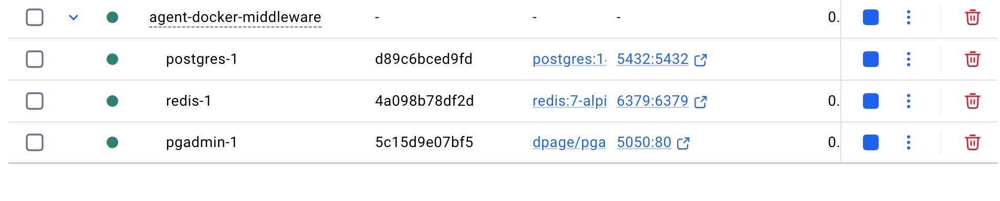

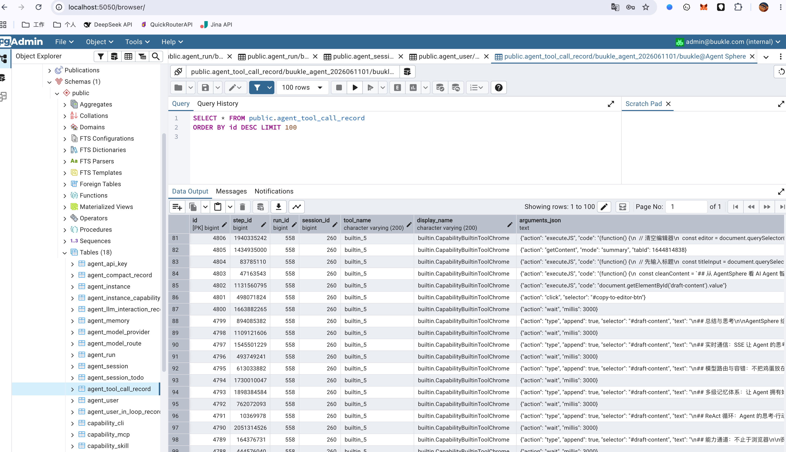

Verify the connection:
```bash
docker compose ps
# Ensure both postgres and redis show status Up
```

### 1.4 Start the Backend

The backend is a Maven multi-module project. A full build is required the first time:

```bash
cd agent-sphere

# First time: full build and install dependencies (skip tests for speed)
mvn install -DskipTests -q

# Start Spring Boot
mvn -pl agent-sphere-bootstrap spring-boot:run -am
```

The backend will start at `http://localhost:8080` with API prefix `/api/v1/...`.

**Environment Variable Overrides (optional):**

| Variable | Default | Description |
|----------|---------|-------------|
| `DB_HOST` | `127.0.0.1` | PostgreSQL host |
| `DB_PORT` | `5432` | PostgreSQL port |
| `DB_USERNAME` | `buukle` | Database username |
| `DB_PASSWORD` | `buukle123` | Database password |
| `REDIS_HOST` | `127.0.0.1` | Redis host |
| `REDIS_PORT` | `6379` | Redis port |

Example:
```bash
DB_HOST=192.168.1.100 mvn -pl agent-sphere-bootstrap spring-boot:run -am
```

After startup, Flyway will automatically execute database migrations. Check the logs to confirm no errors:
```
... Flyway: Successfully applied 1 migration ...
... Started Application in X.XXX seconds ...
```

### 1.5 Start the Frontend

```bash
cd agent-sphere-ui
npm install     # Required the first time (project uses legacy-peer-deps)
npm run dev
```

The frontend dev server will start at `http://localhost:8000`. `npm run dev` automatically proxies `/api/` requests to `http://localhost:8080` (see `config/proxy.ts`).

> The SSE (`/stream`) proxy has special configuration: it strips `Accept-Encoding` and sets `Cache-Control: no-transform` to ensure streaming works correctly. Preserve this logic when modifying the proxy.

### 1.6 Register and Log In

1. Open `http://localhost:8000/user/register` in your browser
2. Enter username, password, and display name, then click Register
3. After successful registration, you'll be redirected to the login page. Log in with the same credentials
   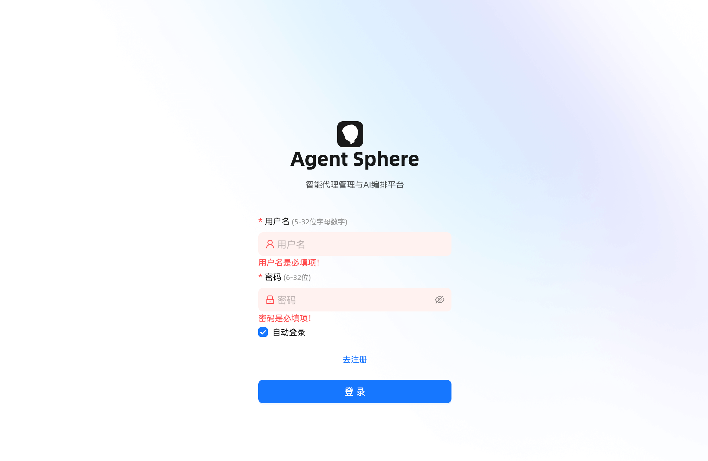
4. After successful login, you'll enter the Dashboard
   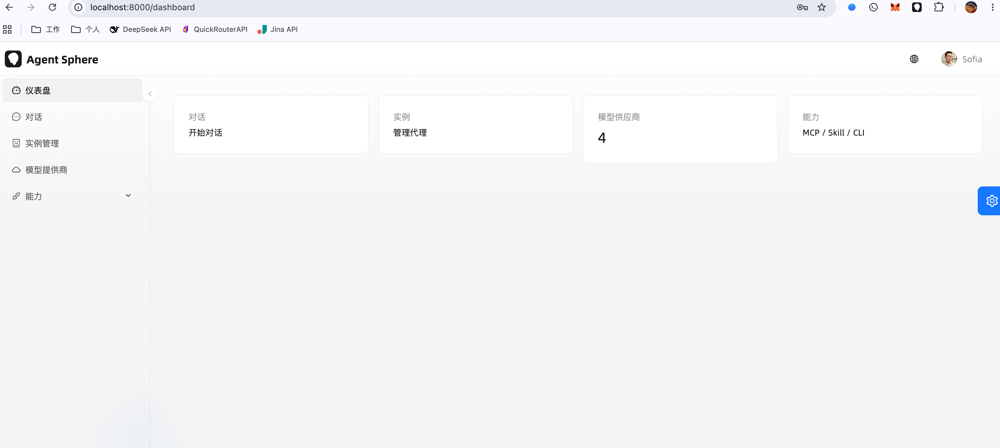


> The registration endpoint `POST /api/v1/auth/register` only requires username + password, with no email verification step.

### 1.7 Load the Chrome Extension

1. Enter `chrome://extensions` in the Chrome address bar
2. Enable **Developer mode** in the top right corner
3. Click **Load unpacked**
4. Select the `agent-sphere-chrome-extension/` directory from the project
   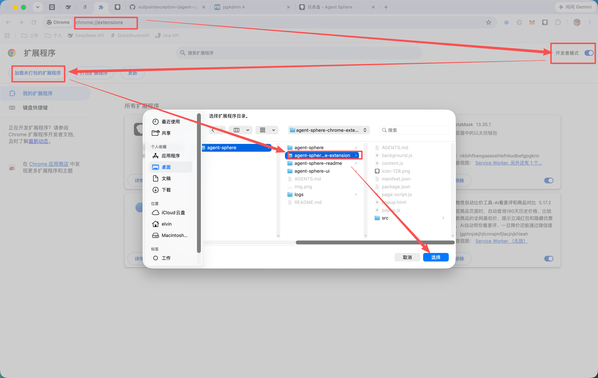
5. The extension icon appears in the toolbar. Click the icon → **Settings** tab
6. Fill in:
    - **Backend URL:** `http://localhost:8080`
    - **Frontend URL:** `http://localhost:8000`
7. Click **Save**
   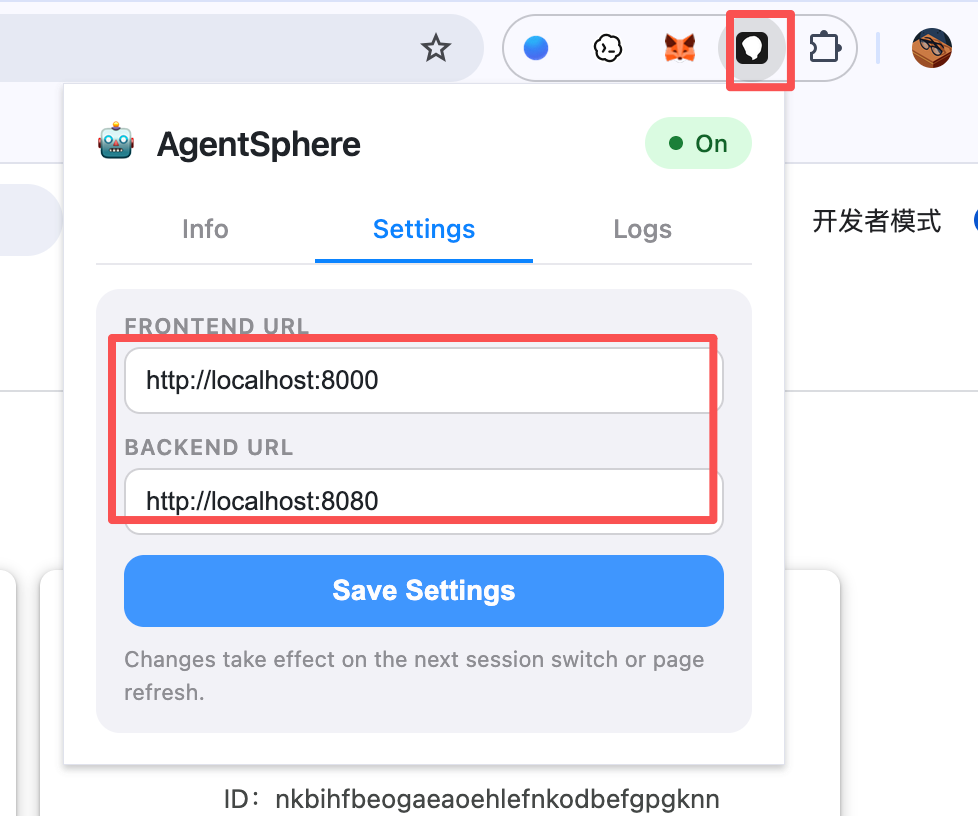

> After each update to the extension code, click the refresh button on the extension card in `chrome://extensions` to reload.

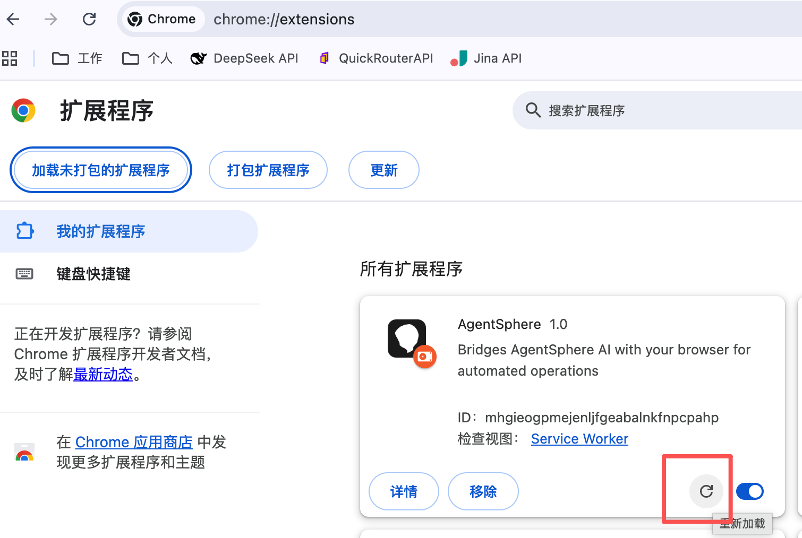

### 1.8 Configure Model Providers

Agent conversations depend on an LLM. You need to configure model providers and routes first.

1. Navigate to the **Model Providers** page in the UI (`/models`)
2. Click **Add Provider**
   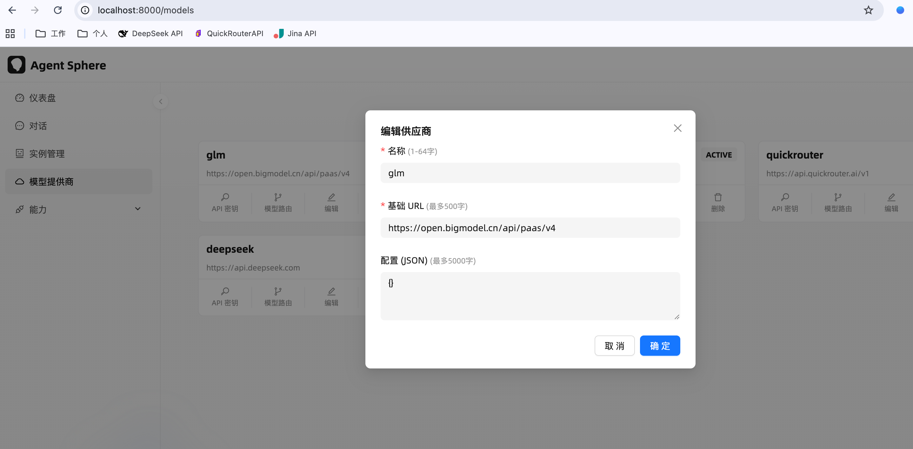
3. Create a **Model Route**:
    - Create a primary route for the provider you just added
    - Set `maxInputTokens` (affects subsequent compaction budget calculation)
    - Optional: add a fallback route that auto-switches when the primary route times out
4. Save the route configuration
   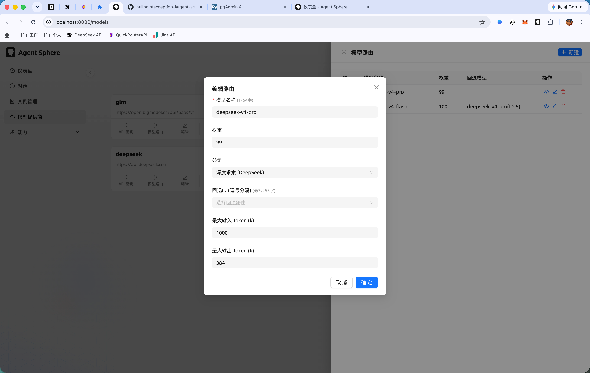

> `maxInputTokens` is important: compaction budget = `maxInputTokens × budget-ratio` (default 0.7). Context compaction is triggered when this budget is exceeded.

5. Create an **API Key**:
    - Create one or more API keys for the provider you just added
    - Use the radio button to select which key to use

   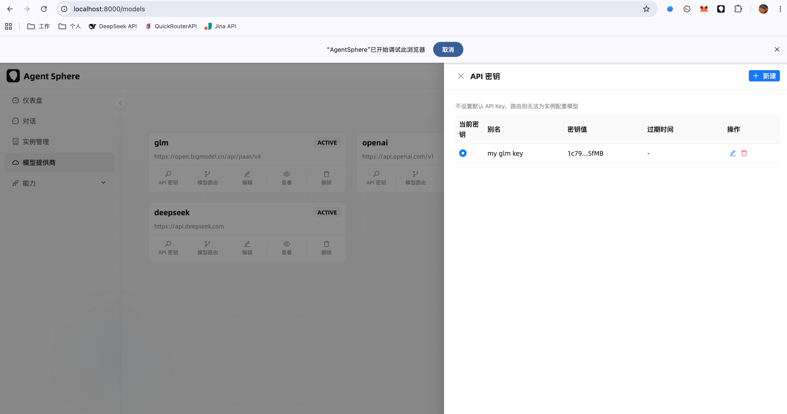


### 1.9 Configure an Agent Instance

1. Navigate to the **Instances** page (`/instances`)
2. Click **Create Instance**
3. Save the instance:
    - **Name**: Instance identifier
    - **System Prompt**: System instructions defining the Agent's role and behavior
4. Configure capabilities and model:
    - **Model Route**: Select the route created in the previous step
    - **Capability Binding**: Bind available capabilities to this instance (MCP / Builtin / CLI / Skill)

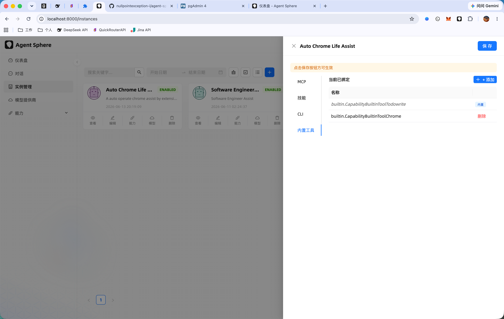
### 1.10 Start a Conversation

1. Navigate to the **Chat** page (`/chat`)
2. Select or create a new session
3. Type a message in the input box and press Enter to send
4. Observe:
    - **Typewriter effect**: LLM outputs token by token
    - **Reasoning panel**: Shows LLM reasoning process and tool call status
    - **Tool calls**: Browser operations, web reading, etc. displayed in real time
    - **SSE push**: Browser DevTools → Network → Filter `/stream`


#### Typical Interaction Examples

```
User: Help me check today's news
Agent: → [calls WebFetch tool] → returns results → organizes and replies
```

```
User: Open Baidu and search for "Guangzhou weather"
Agent: → [Chrome Extension navigates to baidu.com] → [types search query] → [returns screenshot] → replies
```

> Form auto-fill is one of the Builtin tools. The Agent can automatically identify form fields and fill in content.

### 1.11 Debugging Tips

| Scenario | Method |
|----------|--------|
| View backend logs | Real-time output in the backend terminal, or `tail -f agent-sphere/logs/*.log` |
| View frontend logs | Browser DevTools → Console |
| View SSE communication | Browser DevTools → Network → Filter `/stream` |
| Check extension status | Click the extension icon; green "Connected" indicates normal |
| Database queries | `docker exec -it agent-docker-middleware-postgres-1 psql -U buukle -d buukle_agent_2026061101` |
| Check Flyway migrations | `select * from flyway_schema_history;` (execute in psql) |
| Reset database | `docker compose down -v && docker compose up -d` (⚠️ deletes all data) |

### 1.12 Features

| Dimension | Approach |
|-----------|----------|
| **Real-time** | Users can see browser operations happening in real time |
| **Stability** | Tool execution timeouts have fallback mechanisms, won't block subsequent flows |
| **Security** | All operations run through the user's local Chrome, not through the cloud |
| **Extensibility** | Tool SPI mechanism allows registering any type of capability |
| **Observability** | Every tool call has log/event records for traceability |

---
