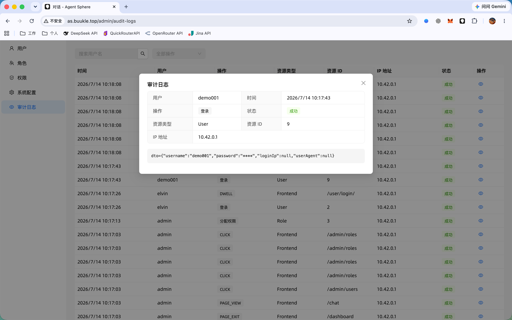

<p align="center">
  
  
  
  
  
  
  
  
  
  
</p>

<p align="center"><b><a href="http://as.buukle.top" target="_blank">🔗 线上预览 / Live Demo → as.buukle.top</a></b></p>
<p align="center"><b>👤 演示账户 / Demo Account: <code>demo001</code> / <code>demo001</code></b></p>

本项目是一个面向 AI Agent 编排平台。它通过 LLM 驱动的决策引擎，结合能力（内置工具、MCP 协议、CLI 执行、浏览器操作等），实现从**感知→规划→执行→反馈**的初级闭环。

支持配置不同模型供应商 : openai ,deepseek ,quickrouter(中转站),bigmodel(智谱AI) ,liteLLM
---

截图效果


可嵌入聊天 Widget（shadow DOM、OIDC SSO、AG-UI 实时流）：


▶ [点击观看视频演示](https://www.bilibili.com/video/BV1WqTT62Efq/)

[](https://www.bilibili.com/video/BV1WqTT62Efq/)

## 功能特性

- **LLM ReAct 编排** — `SessionRunner` 执行 `Plan → Act → Observe → Learn` 循环，支持单轮超时、取消、自动上下文压缩。
- **多供应商模型路由** — 支持 OpenAI / DeepSeek / 智谱（BigModel）/ 中转站，主路由 + fallback 路由链自动降级。
- **统一能力层** — MCP Server、内置 SPI 工具、CLI 执行、浏览器自动化、复合技能，通过 `ToolExecutor` 统一分发。
- **真实浏览器自动化** — Manifest V3 Chrome 扩展桥接，执行 DOM 操作（导航 / 点击 / 输入 / 截图 / executeJS）并实时视觉反馈。
- **多级记忆** — 持久化 run、工具调用记录（写时 JSON 压缩）、基于 token 预算的上下文压缩。
- **人工介入澄清（Human-in-the-loop）** — LLM 通过 `ask_clarification` 工具暂停提问，AG-UI interrupt/resume 恢复执行（`confirm` / `choice` / `input`）。
- **OIDC 多认证源 SSO** — PKCE + JWKS 验签，任意 IdP 登录、JIT 开通本地用户，配合完整 RBAC 与审计日志。
- **可嵌入聊天 Widget** — 单个 IIFE 脚本挂载进 shadow DOM，通过 AG-UI + SSE 自管 Bearer 鉴权对话（不依赖 CopilotKit 运行时），可嵌入任意第三方页面。

## 1. 开发quick start

见 : [QUICK_START-cn.md](QUICK_START-cn.md)

## 2. Architecture

### 2.1 整体结构


### 2.2 核心组件

#### 2.2.1 SessionRunner（ReAct 引擎）

管理一次 AI 会话的完整执行生命周期，实现 **Plan → Act → Observe → Learn** 循环：


**与 ReAct 模式的对齐：**


#### 2.2.2 Capability 能力层

| 能力类型 | 实现 | 说明 | 示例 |
|---------|------|------|------|
| **MCP (Model Context Protocol)** | MCP Server 客户端 | 标准协议，接入任意 MCP Server | Jira、GitHub、Slack、数据库 |
| **Builtin (内置工具)** | SPI: `CapabilityBuiltinToolSpi` | Java SPI 扩展 | WebFetch、WebRead、Chrome、Todowrite、DocWrite |
| **Chrome 浏览器** | Chrome Extension 桥接 | DOM 操作 + 实时视觉反馈 | 导航、点击、填表、截图 |
| **CLI (命令行)** | `ProcessBuilder` 执行 | 本地或远程 Shell | Git 操作、构建部署、系统管理 |
| **Skill (复合技能)** | 多步任务编排 | LLM 驱动的任务分解 | 跨系统工作流 |

#### 2.2.3 Chrome Extension（浏览器桥接）


---

## 3. Algorithm — 核心算法

### 3.1 ReAct 执行循环

AgentSphere 的核心循环遵循 **ReAct (Reasoning + Acting)** 模式，将 LLM 的推理能力和工具执行能力有机结合：


**消息构成：**

```
[
  {role: "system",    content: "你是一个浏览器助手..."},
  {role: "user",      content: "帮我查询广州天气"},
  {role: "assistant", tool_calls: [{id: "call_1", name: "navigate", args: "..."}}]},
  {role: "tool",      tool_call_id: "call_1", content: '{"tabId": 42, "url": "..."}'},
  {role: "assistant", content: "广州明天天气是..."},
  {role: "user",      content: "明天出门该准备什么"},
  ...
]
```

**多轮工具调用示例：**


### 3.2 多级记忆体系 (Memory System)

AgentSphere 实现了多级记忆系统，覆盖从持久化到运行时缓存的完整链路：


#### 记忆层级详细说明

| 层级 | 存储位置 | 生命周期 | 容量 | 用途 |
|------|---------|---------|------|------|
| L1: KernelContext | ConcurrentHashMap | run 期间 (TTL 30min) | 1 per session | 工具列表、模型路由 |
| L2: Messages | ArrayList | run 期间 | 数十轮对话 | LLM 输入输出 |
| L3: LLM Interaction | PostgreSQL | 永久 | 可配置 | 调试审计 |
| L4: Tool Call | PostgreSQL | 永久 | 无限 | 回放、观测 |
| L5: Compact Record | PostgreSQL | 永久 | 累计 | 上下文压缩 |
| L6: Session | PostgreSQL | 永久 | 1 per session | 元数据 |

#### 3.2.1 上下文组装 (Context Assembly)

`HistoryLoader` 负责从持久化存储中加载历史消息，组装成 LLM 的上下文：


**工具结果压缩流程：**


#### 3.2.2 上下文压缩 (Compaction)

当 messages 的估算 token 超过 `maxInputTokens × budget-ratio` 时触发：


**压缩链完整流程：**


#### 3.2.3 工具调用记录状态机


每条记录包含：
- `callId` — LLM 生成的工具调用 ID（如 `call_abc123`）
- `argumentsJson` — 原始入参
- `compressedArguments` — 入参 JSON 压缩版（写时压缩）
- `artifact` — 原始返回结果
- `compressedArtifact` — 结果 JSON 压缩版（写时压缩）
- 用于 HistoryLoader 回放、观测面板展示、审计

#### 3.2.4 工具结果压缩策略

```java
jsonCompress(node, depth, maxValueChars) {
  if (depth > 5) return "[deep nested]";

  if (node instanceof Map) {
    // 递归压缩每个值
    return map.mapValues(v -> jsonCompress(v, depth+1, maxValueChars))
  }

  if (node instanceof List) {
    if (list.size() <= 5) return list.map(v -> jsonCompress(v, depth+1))
    // 大数组: 保留前 3 个 + 总数
    return { _count: 13, _showing: 3, items: [...] }
  }

  if (node instanceof String) {
    if (text.length() <= maxValueChars) return text
    // 长字符串: 前 100 + 省略 + 后 50
    return text[0..100] + "...[+ N chars]...\n" + text[-50..-1]
  }

  return node // Number, Boolean 直通
}
```

### 3.3 模型路由与 Fallback

AgentSphere 提供了多层次的模型容错机制，确保 LLM 调用的高可用性。

#### 路由配置


#### Fallback 执行流程


> 说明：压缩预算计算基于实际 route 的 maxInputTokens，在 execute 回调内检测。详细公式见下方。

#### 压缩预算计算

```
budget = maxInputTokens × budget-ratio (默认 0.7)

示例:
  Route: GLM-4.1V-Thinking-Flash, maxInputTokens=1_000_000
  → budget = 1_000_000 × 0.7 = 700_000 tokens
  → 当 messages 超过 700K token → 触发压缩

动态调整:
  budget-ratio: 0.5  → 更早触发（保留更多上下文质量）
  budget-ratio: 0.8  → 更晚触发（节省压缩开销）
```

#### 超时参数

| 参数 | 默认值 | 说明 |
|------|--------|------|
| `llm.connect-timeout` | 30s | 连接 LLM API 的超时 |
| `llm.read-timeout` | 60s | 读取响应的超时 |
| `llm.stream-read-timeout` | 120s | 流式读取超时 |
| `llm.stream-timeout` | 120s | 流式调用总超时 |
| `runner.turn-timeout` | 180s | 单轮 LLM 调用总超时 |

### 3.4 浏览器操作流程


### 3.5 多标签页管理


### 3.6 超时与取消链


### 3.7 会话跟随（Session Following）


### 3.8 用户澄清（Human-in-the-Loop）

AgentSphere 支持 **用户澄清（User Clarification）** 机制，使 LLM 在遇到模糊或需要用户决策的情况时暂停执行并向用户明确提问，实现 Human-in-the-Loop 模式。

#### 工作流程

1. **LLM 调用**：在执行过程中，当 LLM 需要用户输入（如选择选项、确认操作、补充信息）时，调用内置工具 `ask_clarification`。
2. **暂停并通知**：Run 暂停并进入 `AWAITING_USER` 状态。前端收到 `clarification_pending` SSE 事件，展示澄清卡片（包含 type、title、options）。
3. **用户回应**：用户通过聊天界面中的澄清卡片进行回应：
   - **confirm** — 确认/取消二选一
   - **choice** — 多项选择
   - **input** — 自由文本输入
4. **恢复执行**：系统接收回应后恢复 Run，将 `"[User Response to Clarification]: ..."` 注入 LLM 上下文。如果原始 Run 已结束，则 Fork 新 Run 继续执行。

#### 澄清卡片（UI）


#### 取消机制

用户可随时取消待处理的澄清：
- **卡片取消**：每张澄清卡片都有取消按钮，点击后发送取消信号并停止当前 Run。
- **输入框取消**：存在待处理澄清时，聊天输入框显示停止按钮；点击后取消所有待处理澄清并停止当前 Run。
- **新消息自动取消**：存在待处理澄清时发送新消息，系统自动先取消所有待处理澄清。

#### SSE 事件

| 事件 | 触发时机 | 效果 |
|------|---------|------|
| `clarification_pending` | LLM 调用 `ask_clarification` 工具 | 出现澄清卡片 |
| `clarification_responded` | 用户提交回应 | 卡片显示 ✓，run 继续 |
| `clarification_expired` | 30 分钟 TTL 到期 | 卡片变灰 |
| `clarification_dismissed` | 等待时 run 被取消 | 卡片显示已撤销 |

---

## 4. Administration — 运维与管理

### 4.1 配置说明

| 配置项 | 默认值 | 说明 |
|--------|--------|------|
| `session.idle-timeout` | 30m | 会话空闲超时 |
| `session.max-concurrent-runs` | 10 | 最大并发执行数 |
| `runner.max-loop-count` | 128 | 单次 run 最大循环次数 |
| `runner.turn-timeout` | 180s | 单轮 LLM 调用超时 |
| `runner.compaction.budget-ratio` | 0.7 | 压缩触发阈值（maxInputTokens 比例） |
| `llm.connect-timeout` | 30s | LLM API 连接超时 |
| `llm.read-timeout` | 60s | LLM API 读取超时 |
| `llm.stream-timeout` | 120s | 流式调用总超时 |
| `tool.max-parallel` | 3 | 工具最大并行数 |
| `tool.execution-timeout` | 60s | 单批工具执行超时 |
| `tool.submit-timeout` | 30s | 工具提交超时 |

### 4.2 可观测性 (Observability)

AgentSphere 提供三层观测体系：

#### 4.2.1 实时事件 (SSE Events)

```
LLM 调用链实时推送:

content_token     → "广州明天天气..."
reasoning_token   → "🤔 用户问天气，我需要打开天气网站"
                  → "⚙️ navigate: calling..."
                  → "⚙️ navigate: succeeded ✅"
                  → "⚙️ getContent: calling..."
                  → "⚙️ getContent: succeeded ✅"
                  → "⏹️ Run cancelled" 或 "✅ Run completed"
```

| SSE 事件 | 触发时机 | 前端效果 |
|---------|---------|---------|
| `content_token` | LLM 文本生成 | 打字机效果 |
| `reasoning_token` | LLM 推理、工具状态 | 推理面板 |
| `browser_operation` | Chrome 操作指令 | Extension 执行 |
| `run_running` | Run 开始 | 状态指示 |
| `run_completed` | Run 完成 | 完成通知 |
| `run_failed` | Run 失败 | 错误提示 |
| `tool_call_started` | 工具 PENDING | 工具调用列表 |
| `tool_call_succeeded` | 工具完成 | ✅ 图标 |
| `tool_call_failed` | 工具失败 | ❌ 图标 |
| `compaction_running` | 压缩开始 | 推理面板 |
| `compaction_completed` | 压缩完成 | 推理面板 |
| `clarification_pending` | LLM 请求用户输入 | 澄清卡片（confirm/choice/input） |
| `clarification_responded` | 用户做出回应 | 卡片显示 ✓，run 继续 |
| `clarification_expired` | 澄清 TTL 到期 | 卡片显示已过期 |
| `clarification_dismissed` | Run 被取消（等待用户时） | 卡片显示已撤销 |

#### 4.2.2 Run Activity API

提供完整的工具调用历史查询：

```
GET /api/v1/instance/runs/{runId}/activities?offset=0&limit=20

Response:
{
  "total": 20,
  "records": [
    { "activityType": "llm_interaction",
      "modelName": "deepseek-v4-flash",
      "interactionType": "CHAT_REPLY",
      "durationMs": 2588,
      "requestBody": "{...}",
      "responseBody": "{...}",
      "success": true },
    { "activityType": "tool_call",
      "toolName": "builtin_5",
      "displayName": "builtin.CapabilityBuiltinToolChrome",
      "argumentsJson": "{...}",
      "artifact": "{...}",
      "status": "SUCCEEDED" }
  ]
}
```

#### 4.2.3 会话面板 (Session Panel)

| 视图 | 内容 |
|------|------|
| **Run 列表** | 按 session 查看历史 run，展示 userMessage + assistantReply |
| **工具调用列表** | 当前会话最新的工具调用记录（按创建时间倒序） |
| **待办列表** | 当前会话的 todo 清单，支持状态跟踪 |
| **操作日志** | Chrome Extension popup 中的历史操作记录 |

### 4.3 日志体系

| 日志级别 | 输出 | 用途 |
|---------|------|------|
| `ControllerLogAspect` | INFO | API 请求/响应记录 |
| `ChromeCallbackController` | WARN | 浏览器操作失败 |
| `FiberSet` | WARN | 工具超时/失败 |
| `SessionRunner` | INFO | 执行轮次和状态 |
| `LlmInteractionPersistListener` | DEBUG | LLM 交互记录持久化 |
| `RuntimeEventListener` | DEBUG | 工具调用生命周期事件 |

### 4.4 关键部署步骤

```bash
# 1. 编译后端
cd agent-sphere
mvn compile -pl agent-sphere-bootstrap -am

# 2. 启动后端
mvn spring-boot:run -pl agent-sphere-bootstrap

# 3. 启动前端
cd agent-sphere-ui
npm run dev

# 4. 加载 Chrome Extension
# Chrome → chrome://extensions → 开发者模式 → 加载已解压的扩展
# 选择 agent-sphere-chrome-extension 目录

# 5. 配置 URL
# 点击扩展图标 → Settings Tab
# Frontend URL: http://localhost:8000
# Backend URL:  http://localhost:8080
```

### 4.5 架构决策记录 (ADR)

| 决策 | 方案 | 原因 |
|------|------|------|
| **SSE vs WebSocket** | Server-Sent Events | 单向推送无需客户端确认，浏览器原生支持 |
| **fetch+ReadableStream vs EventSource** | fetch + ReadableStream | MV3 Service Worker 中 EventSource 无法携带 Authorization header |
| **Virtual Threads** | Java 21 Virtual Threads | 简化并发模型，每个工具一个虚拟线程 |
| **Chrome Extension 独立部署** | 独立项目 | 不耦合 Web UI，权限隔离 |
| **Multi-emitter SSE** | `List<SseEmitter>` per session | Web UI 和 Extension 共享同一 SSE 通道 |
| **FiberSet cancel(true)** | `CompletableFuture.cancel(true)` | 超时时有效中断阻塞的虚拟线程 |
| **工具结果写时压缩** | `RuntimeEventListener` 压缩后写入 `compressed_artifact` | HistoryLoader 读取时无需重新压缩，减少重复计算 |
| **基于 token 预算的压缩触发** | `shouldCompact` 在 `runTurn` 的 execute 回调内 | 使用实际调用的 model route 的 maxInputTokens，确保准确 |
| **compaction 游标** | `compactedUptoRunId` 标记已压缩的 run | HistoryLoader 跳过已压 run，只加载之后的 |
| **压缩保护循环** | 最多 3 次重试 | 防止网络波动导致压缩失败时无限循环 |

### 4.6 性能优化

#### 4.6.1 虚拟线程并发

将 `runtimeAsyncExecutor` 从固定线程池（8 个核心线程）改为每次请求创建虚拟线程。之前线程池瓶颈限制并发聊天会话数为 8 — 所有池线程都在等待 LLM 流式响应，导致后续请求排队或被拒绝。虚拟线程在 I/O 等待时会被 carrier thread 卸载，允许数百个并发 LLM 流式会话而不消耗 OS 线程资源。

涉及文件：`AsyncConfig.java`

#### 4.6.2 LLM 流超时修复

重构 `KernelLlmService.stream()` 方法，使 `CountDownLatch.await(timeout)` 独立于阻塞的 `modelProviderSpi.stream()` 调用运行。之前如果 HTTP 流挂起，超时永远不会触发，因为 latch wait 放在阻塞调用之后。

修复方案：流式调用在独立的虚拟线程上运行，当前线程等待 latch 并应用配置的 `stream-timeout`。超时时 `CompletableFuture` 立即异常完成，释放调用方。

涉及文件：`KernelLlmService.java`

#### 4.6.3 HTTP 流读取超时

在 `ModelProviderServiceImpl.streamEvents()` 中增加读取超时机制：
- 从同步 `httpClient.send()` 改为 `sendAsync().orTimeout()` 用于初始响应超时
- 增加定时 `Thread.interrupt()` 用于流式 body 读取循环
- 两者都使用 `stream-read-timeout`（默认 120s）配置值

涉及文件：`ModelProviderServiceImpl.java`

### 4.7 能力扩展

#### 添加新的内置工具

```java
@Component
public class CapabilityBuiltinToolMyTool implements CapabilityBuiltinToolSpi {
    @Override
    public BuiltinToolEnum getToolType() { return BuiltinToolEnum.MY_TOOL; }

    @Override
    public ToolInfoVO getInfo() {
        ToolInfoVO info = new ToolInfoVO();
        info.setName(BuiltinToolConstants.NAME_PREFIX + "MyTool");
        info.setDescription("Description for LLM");
        info.setParamSchema(ToolSchemaUtil.generateParamSchema(MyToolDTO.class));
        info.setResponseSchema(ToolSchemaUtil.generateParamSchema(MyToolResultVO.class));
        return info;
    }

    @Override
    public ExecuteResult execute(ExecuteContext ctx) {
        MyToolDTO dto = (MyToolDTO) ctx;
        // 实现逻辑
        return new MyToolResultVO(/* result */);
    }
}
```

### 4.8 RBAC（基于角色的权限控制）

AgentSphere 提供完整的 RBAC 权限体系，支持多用户管理和 API 级别的细粒度权限控制。

#### 权限模型

| 组件 | 说明 |
|------|------|
| **用户（User）** | 系统用户，每个用户可分配一个或多个角色 |
| **角色（Role）** | 权限的命名集合，如 "管理员"、"运维"、"观察者" |
| **权限（Permission）** | 单个 API 操作，编码为 `domain:action`（如 `admin:user:read`、`instance:run:write`） |

权限校验在 Controller 层通过 `@WithTenant` 和 `AuthContext` 执行，确保多租户数据隔离。

#### 管理后台界面

RBAC、系统配置与 OIDC 身份源统一在「系统管理」后台中完成（用户、角色、权限、身份源 / SSO、系统配置）：


- **用户管理** — 创建/查看用户并分配角色
- **角色配置** — 创建角色并聚合权限
- **权限分配** — 按角色授予/回收 `domain:action` 权限

### 4.9 审计日志（Audit Log）

AgentSphere 记录所有用户操作到审计日志，用于安全审查和故障排查。

#### 记录的操作

| 分类 | 操作 |
|------|------|
| **用户管理** | 登录、登出、修改密码、更新资料 |
| **角色/权限** | 角色增删改、权限分配 |
| **实例** | Agent 实例增删改 |
| **模型供应商** | 供应商增删改、API Key 管理 |
| **能力** | MCP/Skill/CLI 能力增删改 |
| **会话** | 会话创建删除、消息发送 |

#### 审计日志界面



### 4.10 多认证源（OIDC SSO）

AgentSphere 支持**多个 OIDC 身份认证源**，让第三方业务系统无需本地管理密码即可完成用户登录。每个认证源映射到独立的本地用户（`provider_code + subject`），**不做跨认证源归并**。

#### SSO 登录流程

1. 用户点击登录 → `GET /api/v1/auth/sso/authorize?provider=<code>&redirect_uri=...`
2. 后端校验认证源已启用，生成 PKCE（`S256`）+ `state` + `nonce`，重定向到 IdP。
3. IdP 完成认证 → 回跳到后端回调（`/api/v1/auth/sso/callback`）。
4. 后端用 code 换 token，校验 id_token（issuer / audience / RS256 签名，通过 JWKS），JIT 开通本地用户，并带一次性 `otc` 重定向回去。
5. `POST /api/v1/auth/sso/exchange` 用 `otc` 换取本地登录 token。

#### 管理认证源

打开 **系统管理 → 身份源管理** 即可在界面上配置（无需写 SQL）—— 即 [4.8](#48-rbac基于角色的权限控制) 中展示的同一管理后台：

| 字段 | 说明 |
|------|------|
| 标识 Code | 唯一认证源标识 —— 必须与 `authorize` 传入的 `provider` 一致（如 `business`） |
| 名称 | 显示名称 |
| Issuer | OIDC issuer 地址 |
| Client ID / Client Secret | 机密客户端凭据；secret **加密存储**（AES-GCM），接口只返回脱敏值 |
| Authorization / Token Endpoint | IdP 端点 |
| JWKS URL | 用于校验 id_token 签名的公钥集 |
| Scopes | 如 `openid email profile` |
| 启用 | 控制该认证源是否允许登录 |

每个认证源可**测试连接**（`POST /api/v1/admin/identity-providers/{id}/test`）：拉取 JWKS 并用无效 grant 请求 token 端点 —— 任意 4xx 视为可达，网络错误/5xx 判定失败。

权限：`admin:identity-provider:read/create/update/delete`（迁移已授权给 ADMIN 与 USER 角色）。

#### IdP 侧要求

- OIDC **authorization code** 流程，且为**机密客户端**（有 client_secret）。
- 支持 PKCE（`S256`）与 `nonce`。
- id_token 使用 **RS256** 签名，可通过 JWKS 公钥校验。
- 在 IdP 注册的回调地址：`<后端公网地址>/api/v1/auth/sso/callback`。

### 4.11 嵌入聊天 Widget

`agent-sphere-copilot-widget` 是一个**独立可嵌入的聊天组件**，第三方业务系统只需一行脚本即可接入。它把 CopilotKit + AG-UI 打包成单个 IIFE 脚本，挂载进 **shadow DOM**，并通过上述 OIDC SSO 完成认证 —— 不依赖 CopilotKit 云服务/运行时（认证完全自管）。

#### 嵌入方式

```html
<script src="https://as-widget.buukle.top/agent-sphere-widget.js"></script>
<script>
  window.AgentSphereWidget.init({
    apiBase: 'https://as.buukle.top/api/v1', // AgentSphere 后端地址
    provider: 'business',                    // 认证源标识
    autoLogin: true,                         // 加载时静默探测登录
    title: 'Agent Sphere 助手',
  });
</script>
```

| 参数 | 默认值 | 说明 |
|------|--------|------|
| `apiBase` | `/api/v1` | 后端 API 前缀（跨域时填绝对地址） |
| `provider` | `business` | 身份源管理页配置的认证源标识 |
| `autoLogin` | `true` | 加载时尝试静默登录（`prompt=none`） |
| `title` | `Agent Sphere 助手` | Widget 头部标题 |
| `mountTo` | `undefined` | 可选 DOM 元素。传入后 Widget 静态填充该容器（不做悬浮）；否则渲染为右下角悬浮气泡 |

#### 截图

SSO 登录页（选择身份源）：


配置多个身份源：


嵌入第三方业务系统页面（`mountTo` 宿主模式）：


#### 工作原理

- **OIDC SSO**：消费 `?otc=` → 换取 token → 存入 `sessionStorage`（`agent-sphere-widget:agent-user`）；处理完成后从 URL 移除 `?otc=`/`?error=`。`autoLogin` 做一次性静默探测（`prompt=none`）；登录页可让用户选择已启用的身份源。
- **Agent 列表与会话**：来自 `/instance/instances/all` 与 `/instance/sessions`（增删改查）。会话支持新建、行内重命名（✓/✕）、归档（行内两步确认），并带无限滚动分页。
- **对话（AG-UI）**：每个 Agent 对应一个 `HttpAgent`，请求 `{apiBase}/copilot/agent/{id}/services/chat/run`；后端以 SSE `data:` 行推送 AG-UI 事件（`TEXT_MESSAGE_*`、`REASONING_MESSAGE_*`、`TOOL_CALL_*`、`RUN_*`）。请求携带 `Authorization: Bearer`，不经过 CopilotKit 运行时。
- **澄清（人工介入）**：Agent 中断暂停时，聊天内即时出现澄清卡片（confirm / choice / input）。回复或取消通过 AG-UI `resume` 恢复执行（`resolved` / `cancelled`）；已答复的卡片也会从会话历史中渲染。
- **实时更新**：会话标题通过 `session_title_updated` 自定义事件实时同步；辅助面板展示当前任务清单（`STATE_SNAPSHOT` todos）与工具调用动态（悬浮查看详情）。
- **宿主模式**：传入 `mountTo` 后 Widget 静态渲染在你的布局中（如抽屉或区域块），而不是悬浮气泡。

#### 开发调试

```bash
cd agent-sphere-copilot-widget
npm install
npm run dev        # vite dev on :5173，/api 代理到 localhost:8080
npm run build      # tsc + vite lib IIFE -> dist/agent-sphere-widget.js
```

> 注意：rollup 4 将各平台二进制声明为可选依赖。**切勿跨机器复制 `node_modules`/`package-lock.json`** —— 若报 `Cannot find module @rollup/rollup-*`，在目标机器上执行 `rm -rf node_modules package-lock.json && npm i`。

---

## 5. 项目结构


## 6. 技术栈

| 领域 | 技术 |
|------|------|
| **后端运行时** | Java 21, Spring Boot 3.4, Virtual Threads |
| **数据库** | PostgreSQL, Flyway 迁移 |
| **缓存/分布式锁** | Redis (Redisson) |
| **前端** | React, UmiJS, Ant Design Pro |
| **聊天 Widget** | CopilotKit（自管）+ AG-UI, shadow DOM, 单文件 IIFE |
| **Chrome 扩展** | Manifest V3, Service Worker, Content Script |
| **认证** | OIDC 多认证源 SSO（PKCE / JWKS）, RBAC, 审计日志 |
| **实时通信** | SSE (Server-Sent Events), 多 emitter 广播 |
| **工具协议** | MCP (Model Context Protocol, Streamable HTTP) |
| **API 安全** | Bearer Token, @WithTenant 多租户 |
| **LLM 集成** | SPI 供应商抽象, 自动 Fallback 路由 |

## 7. MCP 集成示例

AgentSphere 支持通过 MCP 协议接入任意外部服务。以 Jira 为例：

```bash
# 1. 部署 Jira MCP Server
npx @roovet/jira-mcp --port 3100

# 2. 在 AgentSphere 管理后台添加 MCP 能力
curl -X POST /api/v1/capability/mcp \
  -d '{"name":"Jira MCP","serverUrl":"http://localhost:3100","serverType":"streamable-http"}'

# 3. 绑定到 Agent 实例
curl -X POST /api/v1/instance/instance-capabilities \
  -d '{"instanceId":1,"capabilityType":"mcp","capabilityId":1}'

# 4. 用户只需在聊天中发指令
# "帮我查询 Jira 上我的未完成任务"
# → LLM 调用 MCP tool → Jira API → 返回结果
```


## 8. License

MIT License

Copyright (c) 2026 Buukle
