本项目是一个面向 AI Agent 编排平台。它通过 LLM 驱动的决策引擎，结合能力（内置工具、MCP 协议、CLI 执行、浏览器操作等），实现从**感知→规划→执行→反馈**的初级闭环。

---
运行预览
https://www.bilibili.com/video/BV1bxjk6VEG6/?vd_source=c85252e0a26262947782e1b02533fb15

## 1. 开发quick start

见 : [QUICK_START.md](QUICK_START.md)

## 2. Architecture

### 2.1 整体结构

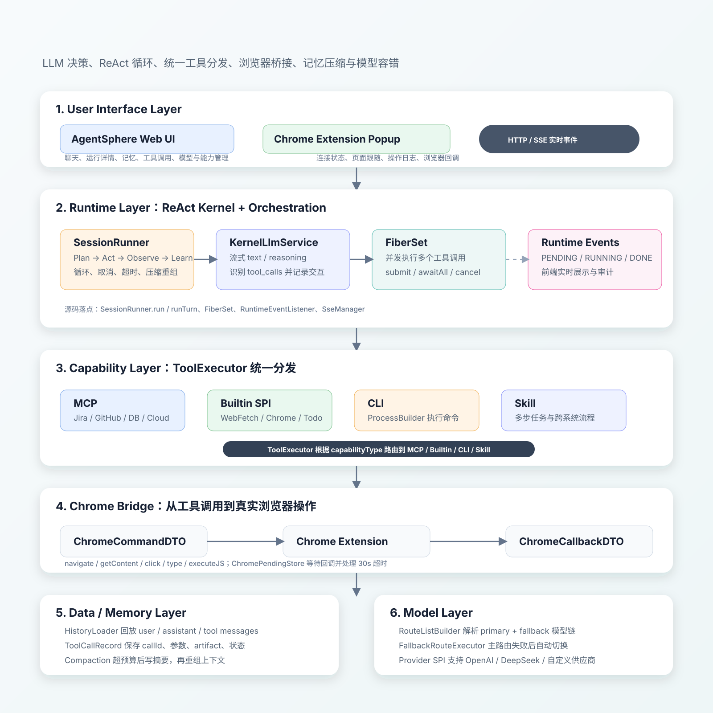

### 2.2 核心组件

#### 2.2.1 SessionRunner（ReAct 引擎）

管理一次 AI 会话的完整执行生命周期，实现 **Plan → Act → Observe → Learn** 循环：

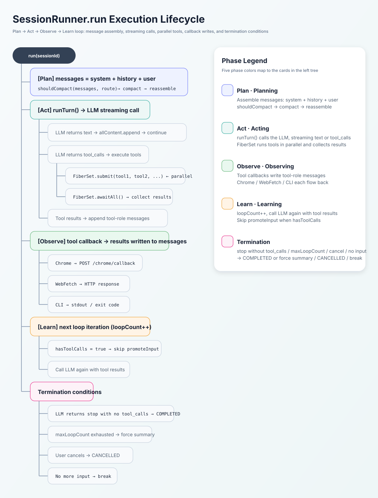

**与 ReAct 模式的对齐：**

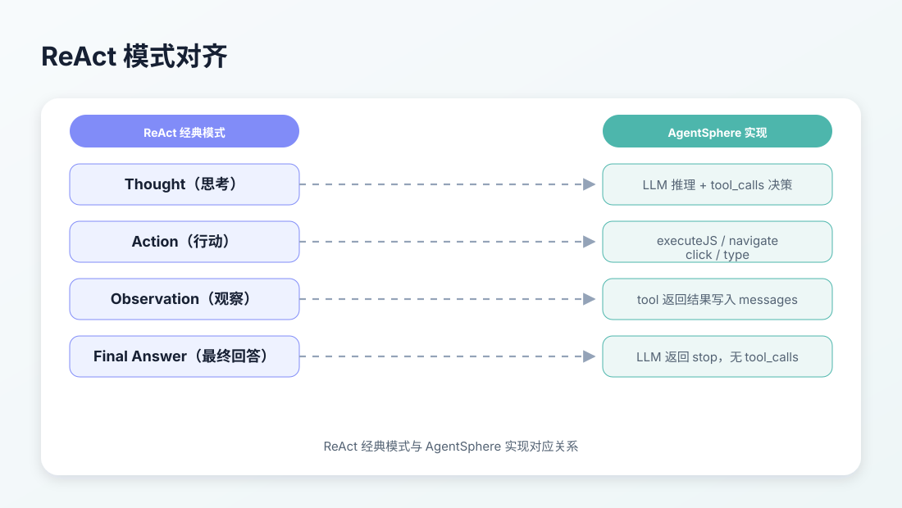

#### 2.2.2 Capability 能力层

| 能力类型 | 实现 | 说明 | 示例 |
|---------|------|------|------|
| **MCP (Model Context Protocol)** | MCP Server 客户端 | 标准协议，接入任意 MCP Server | Jira、GitHub、Slack、数据库 |
| **Builtin (内置工具)** | SPI: `CapabilityBuiltinToolSpi` | Java SPI 扩展 | WebFetch、WebRead、Chrome、Todowrite |
| **Chrome 浏览器** | Chrome Extension 桥接 | DOM 操作 + 实时视觉反馈 | 导航、点击、填表、截图 |
| **CLI (命令行)** | `ProcessBuilder` 执行 | 本地或远程 Shell | Git 操作、构建部署、系统管理 |
| **Skill (复合技能)** | 多步任务编排 | LLM 驱动的任务分解 | 跨系统工作流 |

#### 2.2.3 Chrome Extension（浏览器桥接）

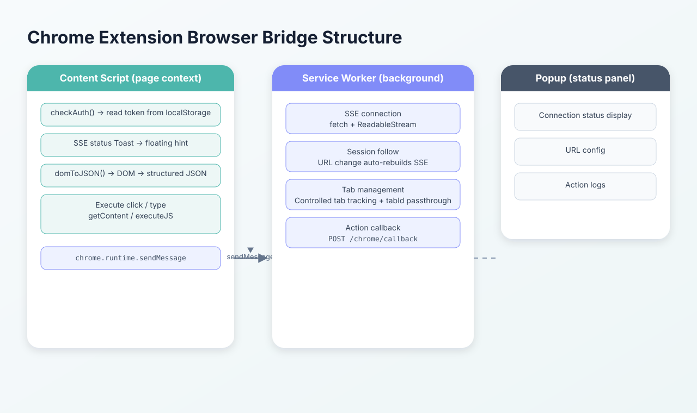

---

## 3. Algorithm — 核心算法

### 3.1 ReAct 执行循环

AgentSphere 的核心循环遵循 **ReAct (Reasoning + Acting)** 模式，将 LLM 的推理能力和工具执行能力有机结合：

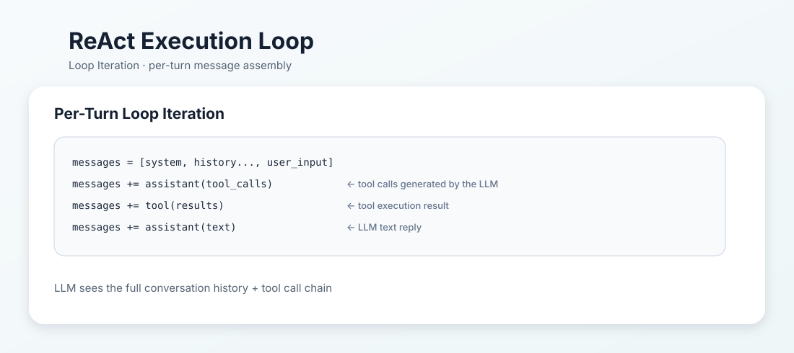

**消息构成：**

```
[
  {role: "system",    content: "你是一个浏览器助手..."},
  {role: "user",      content: "帮我查询广州天气"},
  {role: "assistant", tool_calls: [{id: "call_1", name: "navigate", args: "..."}}]},
  {role: "tool",      tool_call_id: "call_1", content: '{"tabId": 42, "url": "..."}'},
  {role: "assistant", content: "广州明天天气是..."},
  {role: "user",      content: "明天出门该准备什么"},
  ...
]
```

**多轮工具调用示例：**

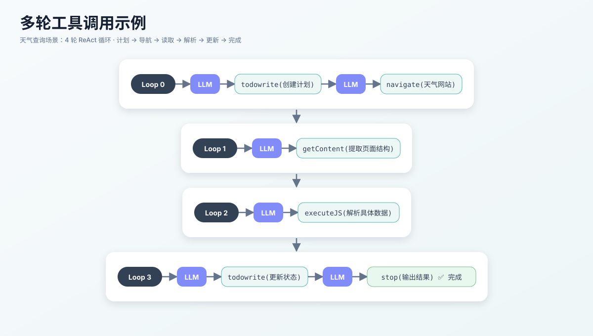

### 3.2 多级记忆体系 (Memory System)

AgentSphere 实现了多级记忆系统，覆盖从持久化到运行时缓存的完整链路：

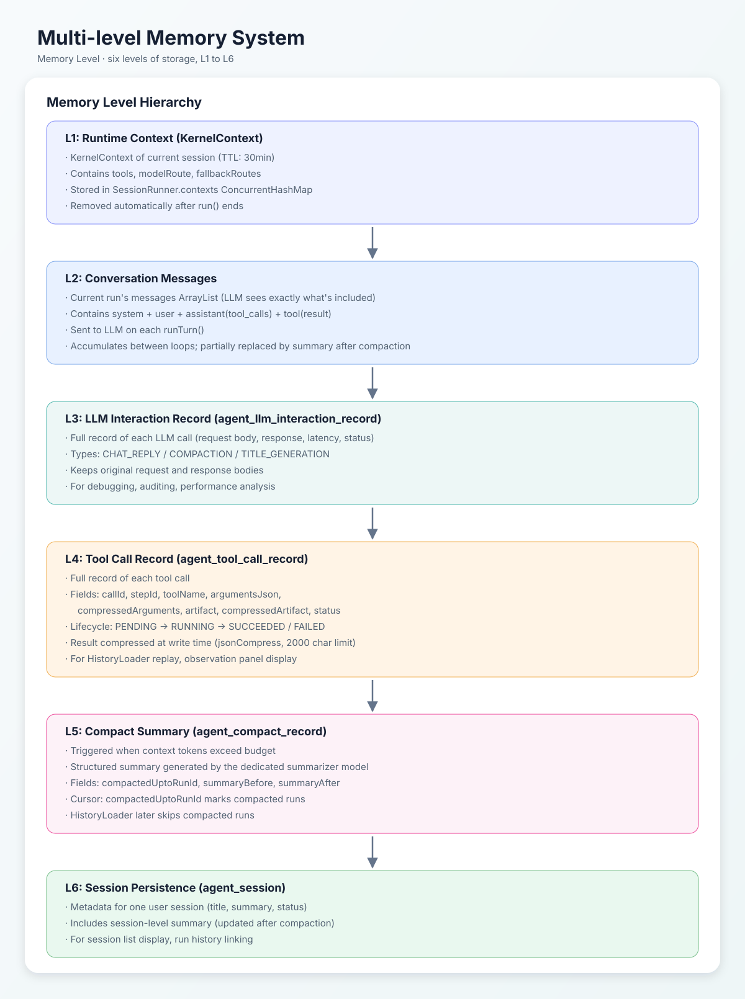

#### 记忆层级详细说明

| 层级 | 存储位置 | 生命周期 | 容量 | 用途 |
|------|---------|---------|------|------|
| L1: KernelContext | ConcurrentHashMap | run 期间 (TTL 30min) | 1 per session | 工具列表、模型路由 |
| L2: Messages | ArrayList | run 期间 | 数十轮对话 | LLM 输入输出 |
| L3: LLM Interaction | PostgreSQL | 永久 | 可配置 | 调试审计 |
| L4: Tool Call | PostgreSQL | 永久 | 无限 | 回放、观测 |
| L5: Compact Record | PostgreSQL | 永久 | 累计 | 上下文压缩 |
| L6: Session | PostgreSQL | 永久 | 1 per session | 元数据 |

#### 3.2.1 上下文组装 (Context Assembly)

`HistoryLoader` 负责从持久化存储中加载历史消息，组装成 LLM 的上下文：

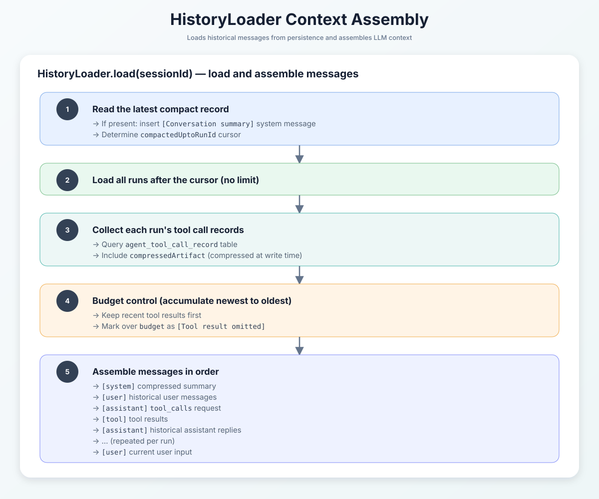

**工具结果压缩流程：**

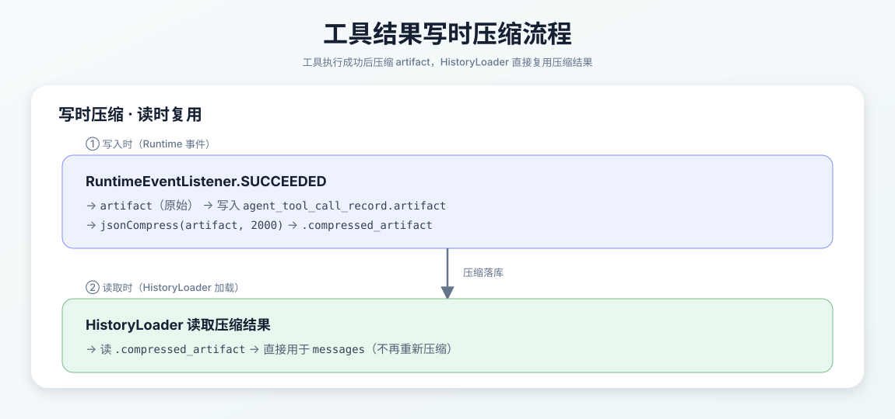

#### 3.2.2 上下文压缩 (Compaction)

当 messages 的估算 token 超过 `maxInputTokens × budget-ratio` 时触发：

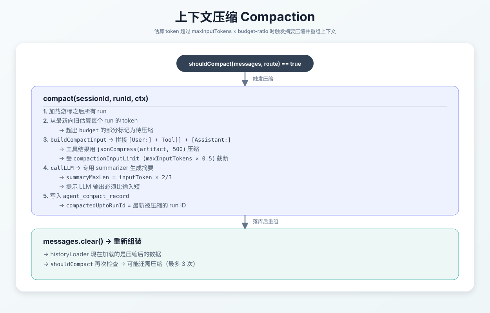

**压缩链完整流程：**

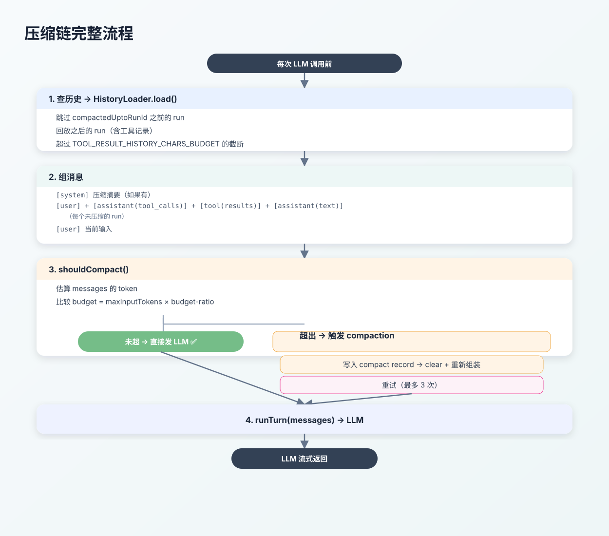

#### 3.2.3 工具调用记录状态机

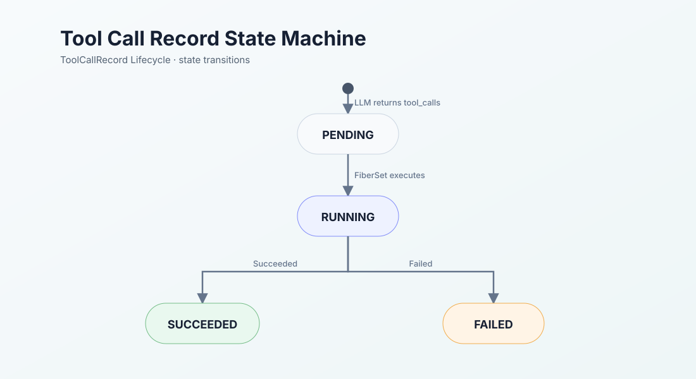

每条记录包含：
- `callId` — LLM 生成的工具调用 ID（如 `call_abc123`）
- `argumentsJson` — 原始入参
- `compressedArguments` — 入参 JSON 压缩版（写时压缩）
- `artifact` — 原始返回结果
- `compressedArtifact` — 结果 JSON 压缩版（写时压缩）
- 用于 HistoryLoader 回放、观测面板展示、审计

#### 3.2.4 工具结果压缩策略

```java
jsonCompress(node, depth, maxValueChars) {
  if (depth > 5) return "[deep nested]";

  if (node instanceof Map) {
    // 递归压缩每个值
    return map.mapValues(v -> jsonCompress(v, depth+1, maxValueChars))
  }

  if (node instanceof List) {
    if (list.size() <= 5) return list.map(v -> jsonCompress(v, depth+1))
    // 大数组: 保留前 3 个 + 总数
    return { _count: 13, _showing: 3, items: [...] }
  }

  if (node instanceof String) {
    if (text.length() <= maxValueChars) return text
    // 长字符串: 前 100 + 省略 + 后 50
    return text[0..100] + "...[+ N chars]...\n" + text[-50..-1]
  }

  return node // Number, Boolean 直通
}
```

### 3.3 模型路由与 Fallback

AgentSphere 提供了多层次的模型容错机制，确保 LLM 调用的高可用性。

#### 路由配置

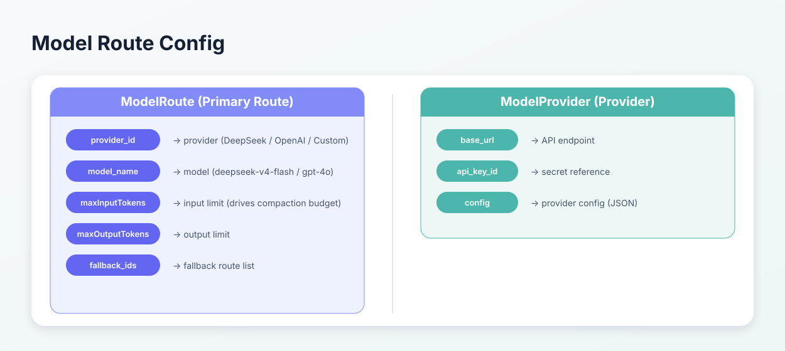

#### Fallback 执行流程

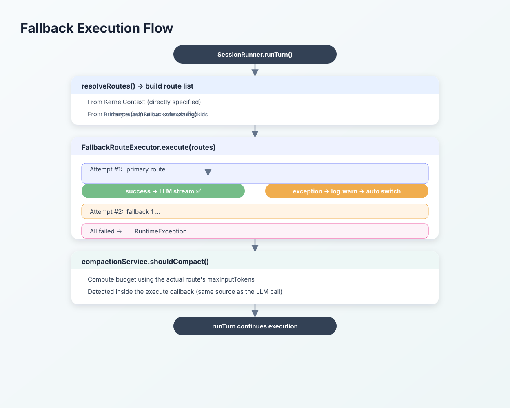

> 说明：压缩预算计算基于实际 route 的 maxInputTokens，在 execute 回调内检测。详细公式见下方。

#### 压缩预算计算

```
budget = maxInputTokens × budget-ratio (默认 0.7)

示例:
  Route: GLM-4.1V-Thinking-Flash, maxInputTokens=1_000_000
  → budget = 1_000_000 × 0.7 = 700_000 tokens
  → 当 messages 超过 700K token → 触发压缩

动态调整:
  budget-ratio: 0.5  → 更早触发（保留更多上下文质量）
  budget-ratio: 0.8  → 更晚触发（节省压缩开销）
```

#### 超时参数

| 参数 | 默认值 | 说明 |
|------|--------|------|
| `llm.connect-timeout` | 30s | 连接 LLM API 的超时 |
| `llm.read-timeout` | 60s | 读取响应的超时 |
| `llm.stream-read-timeout` | 120s | 流式读取超时 |
| `llm.stream-timeout` | 120s | 流式调用总超时 |
| `runner.turn-timeout` | 180s | 单轮 LLM 调用总超时 |

### 3.4 浏览器操作流程

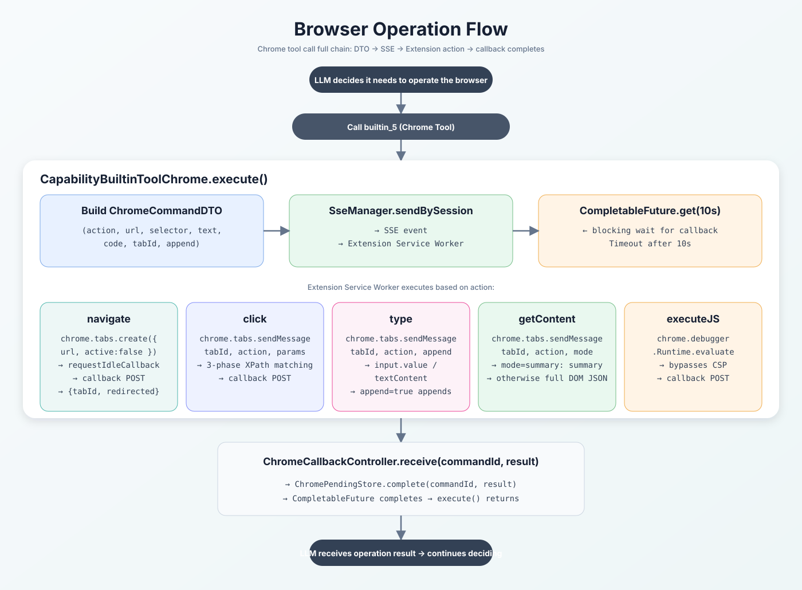

### 3.5 多标签页管理

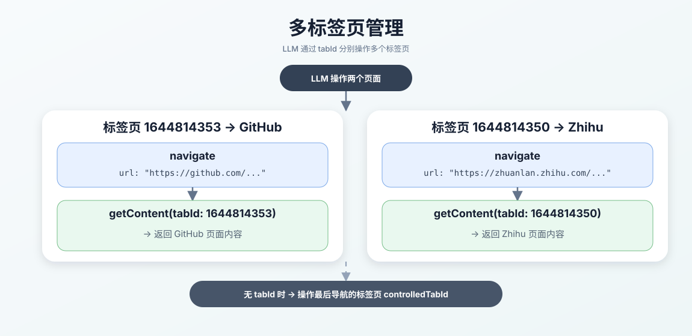

### 3.6 超时与取消链

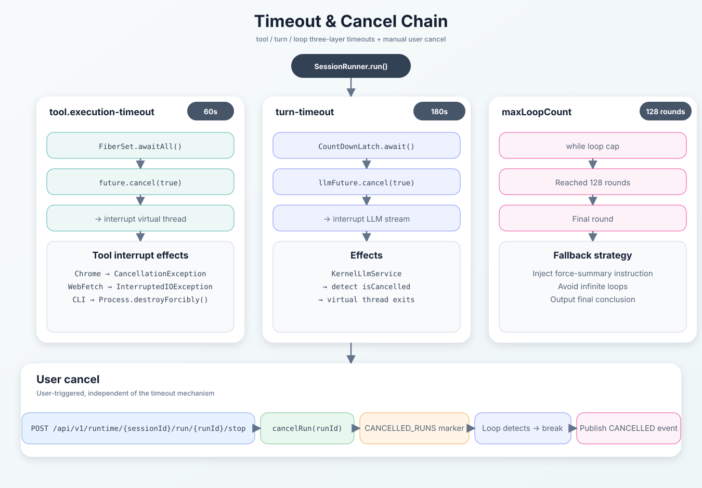

### 3.7 会话跟随（Session Following）

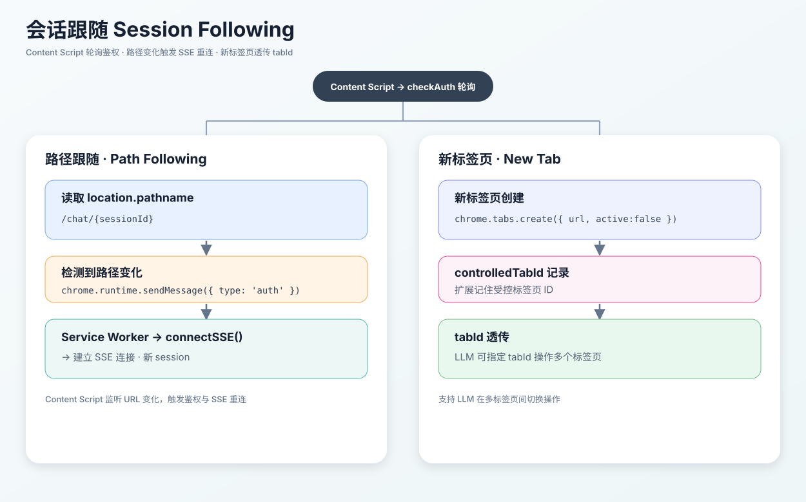

---

## 4. Administration — 运维与管理

### 4.1 配置说明

| 配置项 | 默认值 | 说明 |
|--------|--------|------|
| `session.idle-timeout` | 30m | 会话空闲超时 |
| `session.max-concurrent-runs` | 10 | 最大并发执行数 |
| `runner.max-loop-count` | 128 | 单次 run 最大循环次数 |
| `runner.turn-timeout` | 180s | 单轮 LLM 调用超时 |
| `runner.compaction.budget-ratio` | 0.7 | 压缩触发阈值（maxInputTokens 比例） |
| `llm.connect-timeout` | 30s | LLM API 连接超时 |
| `llm.read-timeout` | 60s | LLM API 读取超时 |
| `llm.stream-timeout` | 120s | 流式调用总超时 |
| `tool.max-parallel` | 3 | 工具最大并行数 |
| `tool.execution-timeout` | 60s | 单批工具执行超时 |
| `tool.submit-timeout` | 30s | 工具提交超时 |

### 4.2 可观测性 (Observability)

AgentSphere 提供三层观测体系：

#### 4.2.1 实时事件 (SSE Events)

```
LLM 调用链实时推送:

content_token     → "广州明天天气..."
reasoning_token   → "🤔 用户问天气，我需要打开天气网站"
                  → "⚙️ navigate: calling..."
                  → "⚙️ navigate: succeeded ✅"
                  → "⚙️ getContent: calling..."
                  → "⚙️ getContent: succeeded ✅"
                  → "⏹️ Run cancelled" 或 "✅ Run completed"
```

| SSE 事件 | 触发时机 | 前端效果 |
|---------|---------|---------|
| `content_token` | LLM 文本生成 | 打字机效果 |
| `reasoning_token` | LLM 推理、工具状态 | 推理面板 |
| `browser_operation` | Chrome 操作指令 | Extension 执行 |
| `run_running` | Run 开始 | 状态指示 |
| `run_completed` | Run 完成 | 完成通知 |
| `run_failed` | Run 失败 | 错误提示 |
| `tool_call_started` | 工具 PENDING | 工具调用列表 |
| `tool_call_succeeded` | 工具完成 | ✅ 图标 |
| `tool_call_failed` | 工具失败 | ❌ 图标 |
| `compaction_running` | 压缩开始 | 推理面板 |
| `compaction_completed` | 压缩完成 | 推理面板 |

#### 4.2.2 Run Activity API

提供完整的工具调用历史查询：

```
GET /api/v1/instance/runs/{runId}/activities?offset=0&limit=20

Response:
{
  "total": 20,
  "records": [
    { "activityType": "llm_interaction",
      "modelName": "deepseek-v4-flash",
      "interactionType": "CHAT_REPLY",
      "durationMs": 2588,
      "requestBody": "{...}",
      "responseBody": "{...}",
      "success": true },
    { "activityType": "tool_call",
      "toolName": "builtin_5",
      "displayName": "builtin.CapabilityBuiltinToolChrome",
      "argumentsJson": "{...}",
      "artifact": "{...}",
      "status": "SUCCEEDED" }
  ]
}
```

#### 4.2.3 会话面板 (Session Panel)

| 视图 | 内容 |
|------|------|
| **Run 列表** | 按 session 查看历史 run，展示 userMessage + assistantReply |
| **工具调用列表** | 当前会话最新的工具调用记录（按创建时间倒序） |
| **待办列表** | 当前会话的 todo 清单，支持状态跟踪 |
| **操作日志** | Chrome Extension popup 中的历史操作记录 |

### 4.3 日志体系

| 日志级别 | 输出 | 用途 |
|---------|------|------|
| `ControllerLogAspect` | INFO | API 请求/响应记录 |
| `ChromeCallbackController` | WARN | 浏览器操作失败 |
| `FiberSet` | WARN | 工具超时/失败 |
| `SessionRunner` | INFO | 执行轮次和状态 |
| `LlmInteractionPersistListener` | DEBUG | LLM 交互记录持久化 |
| `RuntimeEventListener` | DEBUG | 工具调用生命周期事件 |

### 4.4 关键部署步骤

```bash
# 1. 编译后端
cd agent-sphere
mvn compile -pl agent-sphere-bootstrap -am

# 2. 启动后端
mvn spring-boot:run -pl agent-sphere-bootstrap

# 3. 启动前端
cd agent-sphere-ui
npm run dev

# 4. 加载 Chrome Extension
# Chrome → chrome://extensions → 开发者模式 → 加载已解压的扩展
# 选择 agent-sphere-chrome-extension 目录

# 5. 配置 URL
# 点击扩展图标 → Settings Tab
# Frontend URL: http://localhost:8000
# Backend URL:  http://localhost:8080
```

### 4.5 架构决策记录 (ADR)

| 决策 | 方案 | 原因 |
|------|------|------|
| **SSE vs WebSocket** | Server-Sent Events | 单向推送无需客户端确认，浏览器原生支持 |
| **fetch+ReadableStream vs EventSource** | fetch + ReadableStream | MV3 Service Worker 中 EventSource 无法携带 Authorization header |
| **Virtual Threads** | Java 21 Virtual Threads | 简化并发模型，每个工具一个虚拟线程 |
| **Chrome Extension 独立部署** | 独立项目 | 不耦合 Web UI，权限隔离 |
| **Multi-emitter SSE** | `List<SseEmitter>` per session | Web UI 和 Extension 共享同一 SSE 通道 |
| **FiberSet cancel(true)** | `CompletableFuture.cancel(true)` | 超时时有效中断阻塞的虚拟线程 |
| **工具结果写时压缩** | `RuntimeEventListener` 压缩后写入 `compressed_artifact` | HistoryLoader 读取时无需重新压缩，减少重复计算 |
| **基于 token 预算的压缩触发** | `shouldCompact` 在 `runTurn` 的 execute 回调内 | 使用实际调用的 model route 的 maxInputTokens，确保准确 |
| **compaction 游标** | `compactedUptoRunId` 标记已压缩的 run | HistoryLoader 跳过已压 run，只加载之后的 |
| **压缩保护循环** | 最多 3 次重试 | 防止网络波动导致压缩失败时无限循环 |

### 4.6 能力扩展

#### 添加新的内置工具

```java
@Component
public class CapabilityBuiltinToolMyTool implements CapabilityBuiltinToolSpi {
    @Override
    public BuiltinToolEnum getToolType() { return BuiltinToolEnum.MY_TOOL; }

    @Override
    public ToolInfoVO getInfo() {
        ToolInfoVO info = new ToolInfoVO();
        info.setName(BuiltinToolConstants.NAME_PREFIX + "MyTool");
        info.setDescription("Description for LLM");
        info.setParamSchema(ToolSchemaUtil.generateParamSchema(MyToolDTO.class));
        info.setResponseSchema(ToolSchemaUtil.generateParamSchema(MyToolResultVO.class));
        return info;
    }

    @Override
    public ExecuteResult execute(ExecuteContext ctx) {
        MyToolDTO dto = (MyToolDTO) ctx;
        // 实现逻辑
        return new MyToolResultVO(/* result */);
    }
}
```

---

## 5. 项目结构

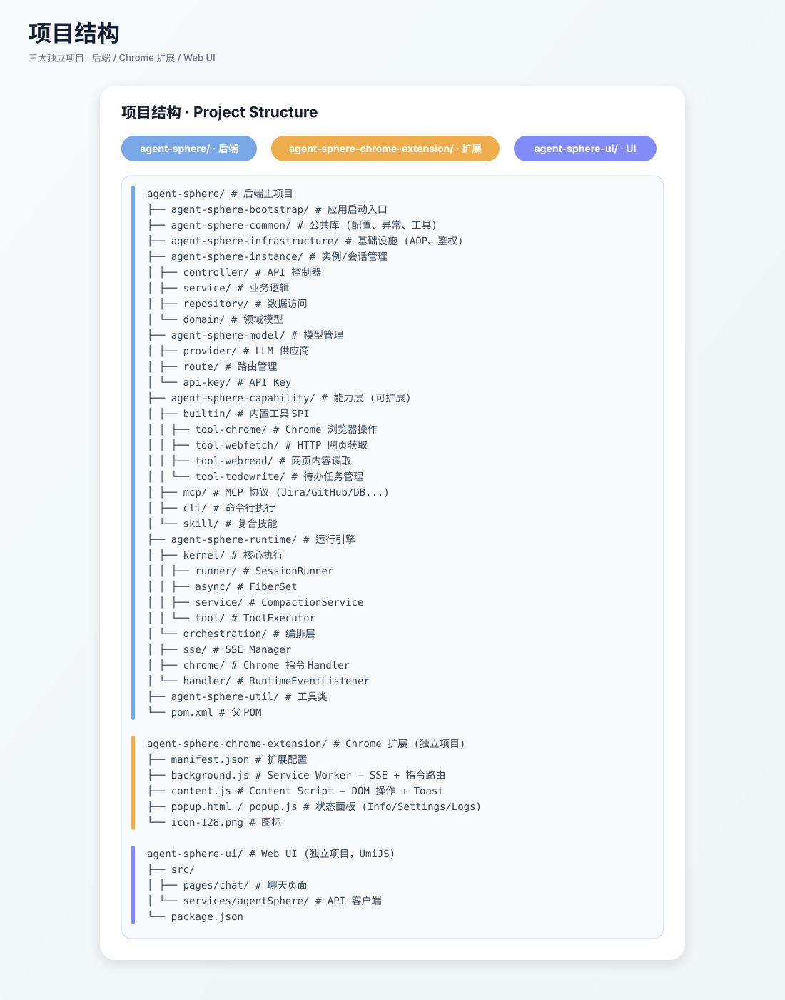

## 6. 技术栈

| 领域 | 技术 |
|------|------|
| **后端运行时** | Java 21, Spring Boot 3.4, Virtual Threads |
| **数据库** | PostgreSQL, Flyway 迁移 |
| **缓存/分布式锁** | Redis (Redisson) |
| **前端** | React, UmiJS, Ant Design Pro |
| **Chrome 扩展** | Manifest V3, Service Worker, Content Script |
| **实时通信** | SSE (Server-Sent Events), 多 emitter 广播 |
| **工具协议** | MCP (Model Context Protocol, Streamable HTTP) |
| **API 安全** | Bearer Token, @WithTenant 多租户 |
| **LLM 集成** | SPI 供应商抽象, 自动 Fallback 路由 |

## 7. MCP 集成示例

AgentSphere 支持通过 MCP 协议接入任意外部服务。以 Jira 为例：

```bash
# 1. 部署 Jira MCP Server
npx @roovet/jira-mcp --port 3100

# 2. 在 AgentSphere 管理后台添加 MCP 能力
curl -X POST /api/v1/capability/mcp \
  -d '{"name":"Jira MCP","serverUrl":"http://localhost:3100","serverType":"streamable-http"}'

# 3. 绑定到 Agent 实例
curl -X POST /api/v1/instance/instance-capabilities \
  -d '{"instanceId":1,"capabilityType":"mcp","capabilityId":1}'

# 4. 用户只需在聊天中发指令
# "帮我查询 Jira 上我的未完成任务"
# → LLM 调用 MCP tool → Jira API → 返回结果
```

## 8. License

MIT License

Copyright (c) 2026 Buukle
