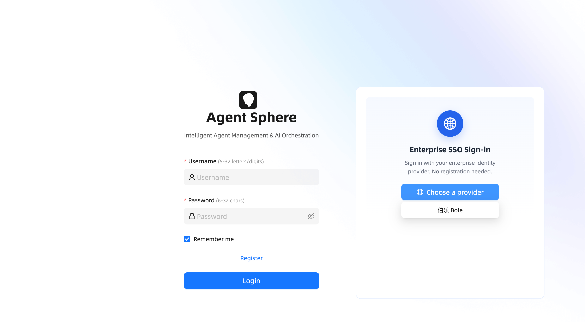
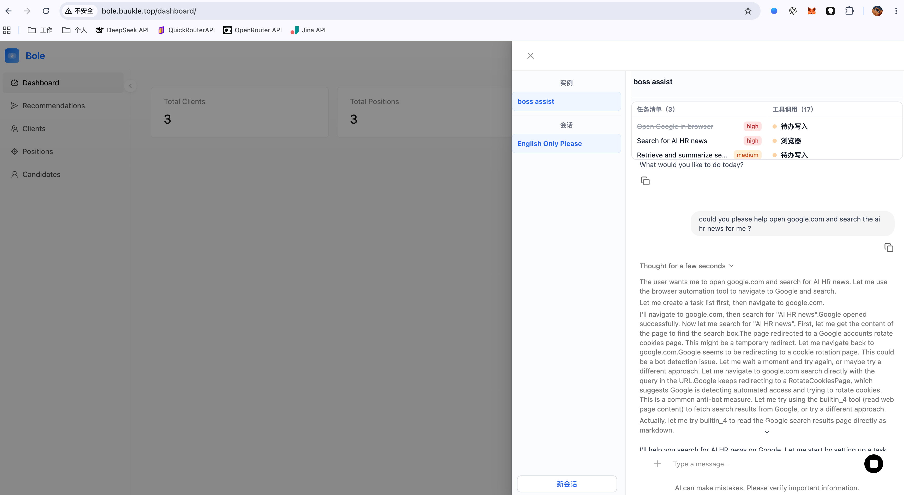
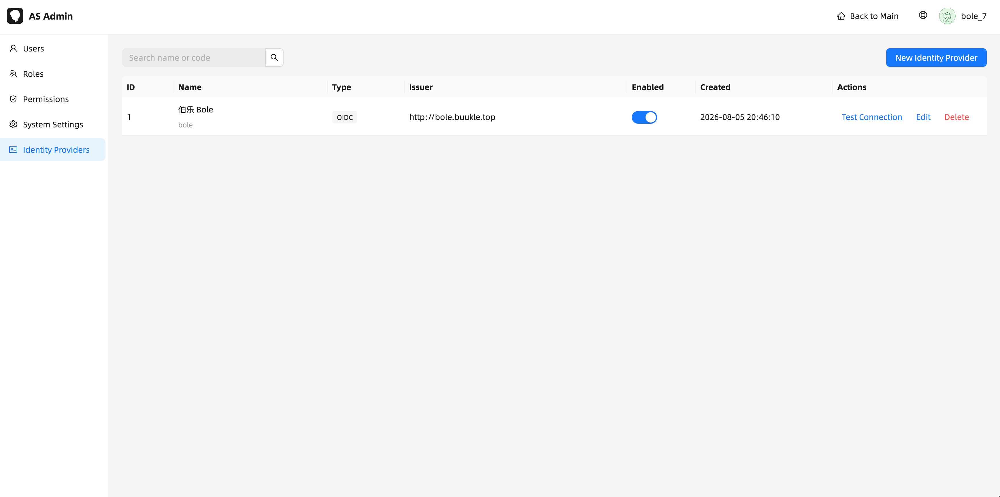
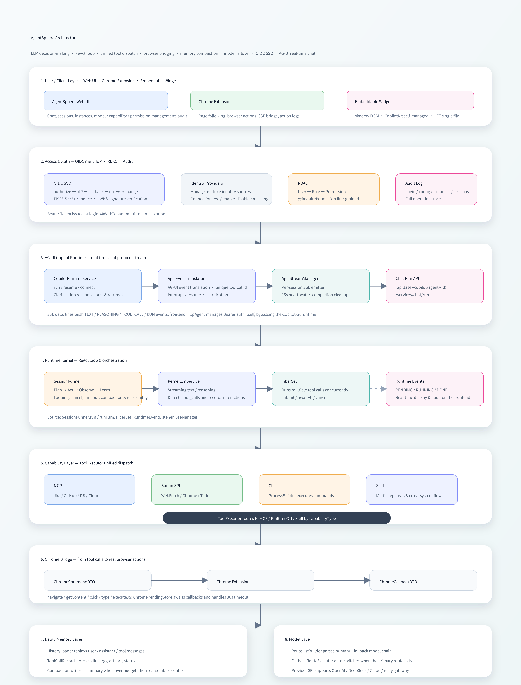
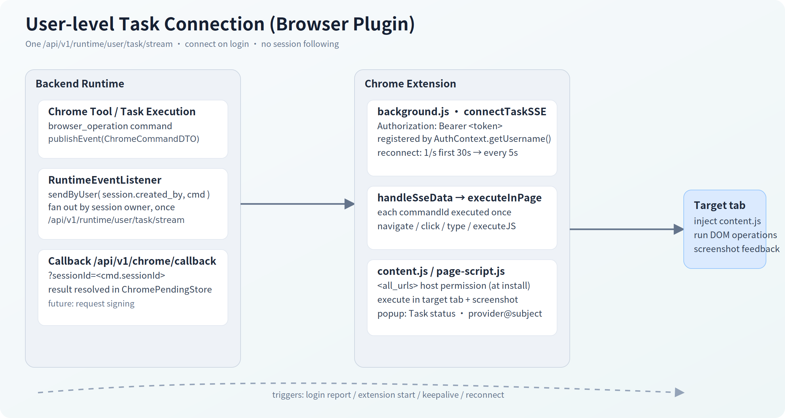
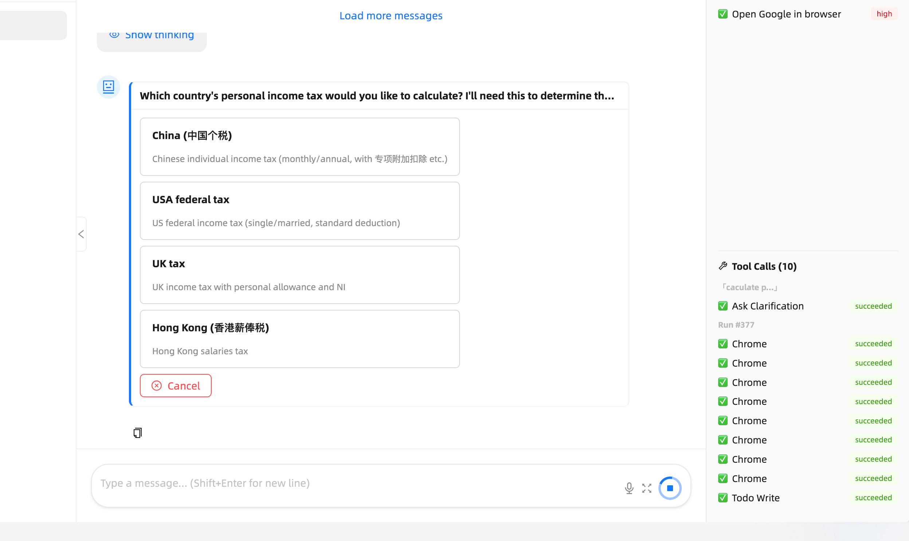
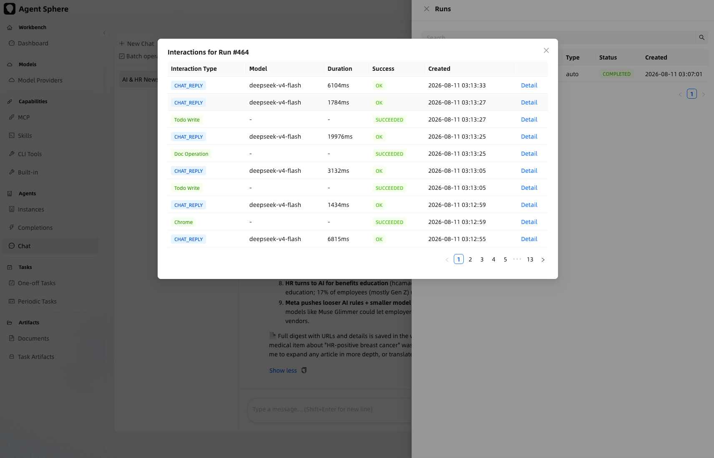
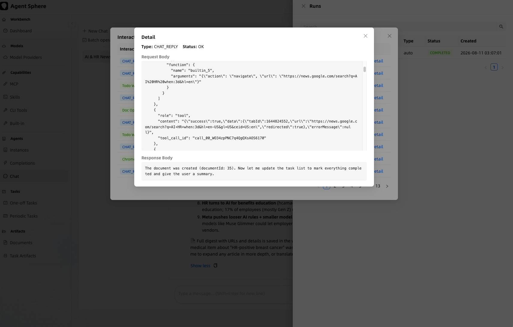
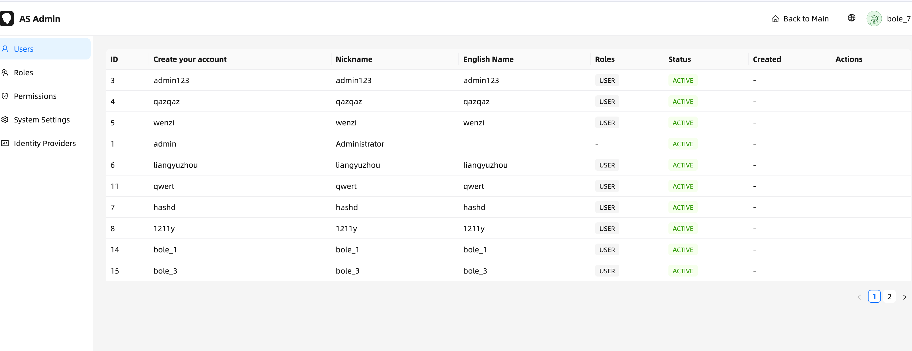
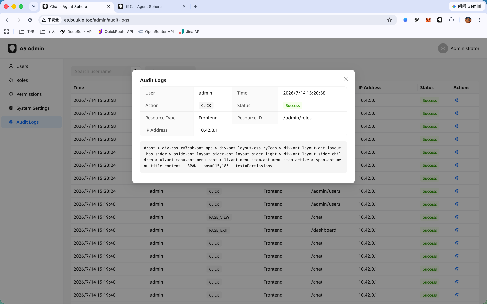

<p align="center">
  
  
  
  
  
  
  
  
  
  
</p>

<p align="center"><b><a href="http://as.buukle.top" target="_blank">🔗 线上预览 / Live Demo → as.buukle.top</a></b></p>
<p align="center"><b>👤 演示账户 / Demo Account: <code>demo001</code> / <code>demo001</code></b></p>

This project is an AI  Agent orchestration platform. Driven by an LLM-based decision engine and combined with capabilities (built-in tools, MCP protocol, CLI execution, browser automation, etc.), it implements a primary closed loop of **Perception → Planning → Execution → Feedback**.

It supports configuring different model providers: OpenAI, DeepSeek, QuickRouter (relay station), BigModel (Zhipu AI), LiteLLM.
---

Screenshots


Embeddable chat widget (shadow DOM, OIDC SSO, AG-UI streaming):







▶ [Click to watch the video demo](https://www.bilibili.com/video/BV1WqTT62Efq/)

[](https://www.bilibili.com/video/BV1WqTT62Efq/)

## Features

- **LLM ReAct orchestration** — `SessionRunner` runs a `Plan → Act → Observe → Learn` loop with per-turn timeout, cancellation, and automatic context compaction.
- **Multi-provider model routing** — OpenAI / DeepSeek / BigModel (Zhipu) / relay stations, with primary + fallback route chains and graceful degradation.
- **Unified capability layer** — MCP servers, built-in SPI tools, CLI execution, browser automation, and composite skills, dispatched through a single `ToolExecutor`.
- **Real browser automation** — a Manifest V3 Chrome Extension bridge performs DOM operations (navigate / click / type / executeJS) with real-time execution feedback.
- **Multi-level memory** — persistent runs, tool-call records with write-time JSON compression, and token-budget based context compaction.
- **Human-in-the-loop clarification** — the LLM pauses with a `ask_clarification` tool and resumes via AG-UI interrupt/resume (`confirm` / `choice` / `input`).
- **OIDC multi-provider SSO** — PKCE + JWKS-verified logins from any IdP, JIT user provisioning, plus full RBAC and audit logging.
- **Per-user private resource copies** — each identity provider declares a `resource_template` JSON; on a user's first login the platform asynchronously provisions a **private copy** (model provider / api key / model route / completions / instance / mcp / skill / document) owned by that user, with row-level `created_by` isolation.
- **Capability Open API** — external systems call `completions` and `tasks` over `/api/v1/api/*` with `code + subject + businessType` identity, plus `businessType`-scoped ownership checks and task callback URLs.
- **Task artifacts** — tasks persist two-phase structured outputs as `agent_task_artifact` rows, reviewable from the **产出 → 任务产物** page (list / detail / JSON view / copy).
- **Completions management** — 提示工程 admin page with input/output JSON Schema, runtime config (`temperature` / `max_tokens` / `top_p` / penalties / `stop` / `thinking`), prompt versioning, and call records.
- **Single user-level browser connection** — the Chrome extension keeps one per-user task SSE stream (no per-session following), `<all_urls>` host permission, and shows the user as `provider@subject`.
- **Embeddable chat widget** — a single IIFE script that mounts into a shadow DOM, talks AG-UI over SSE with self-managed Bearer auth (no CopilotKit runtime), and can be embedded in any third-party page.

## 1. Quick Start for Development

See: [QUICK_START.md](QUICK_START.md)

## 2. Architecture

### 2.1 Overall Structure



### 2.2 Core Components

#### 2.2.1 SessionRunner (ReAct Engine)

Manages the complete execution lifecycle of an AI session, implementing the **Plan → Act → Observe → Learn** loop:


**Alignment with the ReAct pattern:**


#### 2.2.2 Capability Layer

| Capability Type | Implementation | Description | Examples |
|-----------------|----------------|-------------|----------|
| **MCP (Model Context Protocol)** | MCP Server client | Standard protocol, connects to any MCP Server | Jira, GitHub, Slack, databases |
| **Builtin (built-in tools)** | SPI: `CapabilityBuiltinToolSpi` | Java SPI extension | WebFetch, WebRead, Chrome, Todowrite, DocWrite |
| **Chrome Browser** | Chrome Extension bridge | DOM operations + real-time execution feedback | Navigate, click, fill forms, executeJS |
| **CLI (command line)** | `ProcessBuilder` execution | Local or remote shell | Git operations, build/deploy, system administration |
| **Skill (composite skills)** | Multi-step task orchestration | LLM-driven task decomposition | Cross-system workflows |

#### 2.2.3 Chrome Extension (Browser Bridge)

The extension bridges the backend with the user's browser for automated operations. It keeps a **single user-level task SSE connection** (`/api/v1/runtime/user/task/stream`) that delivers `browser_operation` commands for any of the user's sessions/runs — no per-session following. It declares `<all_urls>` host permission (granted at install) so it can inject a content script into any page the agent operates on.

Recent architecture notes:
- **No screenshots** — the screenshot pipeline was removed end-to-end (extension, backend, UI). Process recording is text/event based.
- **SSE lives in an offscreen document** (`offscreen.html/js`) — immune to MV3 service-worker suspension; the background alarm re-creates it if the browser closes it.
- **Native ES modules** — the background service worker (`background.js`, `"type": "module"`) imports `lib/cdp-client.js`, `lib/tab-manager.js`, `lib/result.js`, `lib/offscreen-bridge.js`; the execution layer is `content.js` + `content-locator.js` + `content-editors.js` (injected in order into the isolated world).
- **Tab grouping** — every tab the plugin navigates/opens is auto-grouped under the `AgentSphere` tab group (`tabGroups` permission), recreated if closed.
- **`executeJS` is tiered** (debugger only as last resort): isolated world (`chrome.scripting`) → `inject.js` MAIN-world postMessage bridge → `chrome.scripting` MAIN world → `chrome.debugger` `Runtime.evaluate` (strict-CSP sites).


---

## 3. Algorithm — Core Algorithms

### 3.1 ReAct Execution Loop

The core loop of AgentSphere follows the **ReAct (Reasoning + Acting)** pattern, combining the LLM's reasoning ability with tool execution ability:


**Message structure:**

```
[
  {role: "system",    content: "You are a browser assistant..."},
  {role: "user",      content: "Help me check the weather in Guangzhou"},
  {role: "assistant", tool_calls: [{id: "call_1", name: "navigate", args: "..."}}]},
  {role: "tool",      tool_call_id: "call_1", content: '{"tabId": 42, "url": "..."}'},
  {role: "assistant", content: "The weather in Guangzhou tomorrow is..."},
  {role: "user",      content: "What should I prepare for going out tomorrow"},
  ...
]
```

**Multi-turn tool call example:**


### 3.2 Multi-level Memory System

AgentSphere implements a multi-level memory system covering the full chain from persistence to runtime caching:


#### Memory Level Details

| Level | Storage | Lifecycle | Capacity | Purpose |
|-------|---------|-----------|----------|---------|
| L1: KernelContext | ConcurrentHashMap | During run (TTL 30min) | 1 per session | Tool list, model route |
| L2: Messages | ArrayList | During run | Dozens of turns | LLM input/output |
| L3: LLM Interaction | PostgreSQL | Permanent | Configurable | Debugging & audit |
| L4: Tool Call | PostgreSQL | Permanent | Unlimited | Replay, observation |
| L5: Compact Record | PostgreSQL | Permanent | Cumulative | Context compression |
| L6: Session | PostgreSQL | Permanent | 1 per session | Metadata |

#### 3.2.1 Context Assembly

`HistoryLoader` is responsible for loading historical messages from persistent storage and assembling them into the LLM context:


**Tool result compression flow:**


#### 3.2.2 Context Compaction

Triggered when the estimated tokens of messages exceed `maxInputTokens × budget-ratio`:


**Full compression chain flow:**


#### 3.2.3 Tool Call Record State Machine


Each record contains:
- `callId` — Tool call ID generated by the LLM (e.g., `call_abc123`)
- `argumentsJson` — Original input arguments
- `compressedArguments` — Compressed version of input JSON (write-time compression)
- `artifact` — Original return result
- `compressedArtifact` — Compressed version of result JSON (write-time compression)
- Used by HistoryLoader for replay, observation panel display, and auditing

#### 3.2.4 Tool Result Compression Strategy

```java
jsonCompress(node, depth, maxValueChars) {
  if (depth > 5) return "[deep nested]";

  if (node instanceof Map) {
    // Recursively compress each value
    return map.mapValues(v -> jsonCompress(v, depth+1, maxValueChars))
  }

  if (node instanceof List) {
    if (list.size() <= 5) return list.map(v -> jsonCompress(v, depth+1))
    // Large array: keep first 3 + total count
    return { _count: 13, _showing: 3, items: [...] }
  }

  if (node instanceof String) {
    if (text.length() <= maxValueChars) return text
    // Long string: first 100 + ellipsis + last 50
    return text[0..100] + "...[+ N chars]...\n" + text[-50..-1]
  }

  return node // Number, Boolean pass-through
}
```

### 3.3 Model Routing and Fallback

AgentSphere provides a multi-level model fault-tolerance mechanism to ensure high availability of LLM calls.

#### Routing Configuration


#### Fallback Execution Flow


> Note: The compression budget calculation is based on the actual route's maxInputTokens, detected within the execute callback. See the formula below for details.

#### Compression Budget Calculation

```
budget = maxInputTokens × budget-ratio (default 0.7)

Example:
  Route: GLM-4.1V-Thinking-Flash, maxInputTokens=1_000_000
  → budget = 1_000_000 × 0.7 = 700_000 tokens
  → When messages exceed 700K tokens → trigger compaction

Dynamic adjustment:
  budget-ratio: 0.5  → Triggers earlier (preserves more context quality)
  budget-ratio: 0.8  → Triggers later (saves compression overhead)
```

#### Timeout Parameters

| Parameter | Default | Description |
|-----------|---------|-------------|
| `llm.connect-timeout` | 30s | Timeout for connecting to LLM API |
| `llm.read-timeout` | 60s | Timeout for reading response |
| `llm.stream-read-timeout` | 120s | Stream read timeout |
| `llm.stream-timeout` | 120s | Total timeout for streaming calls |
| `runner.turn-timeout` | 180s | Total timeout for a single LLM turn |

### 3.4 Browser Operation Flow


> Delivery note: `browser_operation` commands are pushed **once** on the user-level task stream (keyed by the session owner), never duplicated on a per-session stream — the extension executes each `commandId` exactly once and reports back via `/api/v1/chrome/callback?sessionId=<cmd.sessionId>`.

### 3.5 Multi-tab Management

Every tab the plugin navigates, opens, or follows (target=_blank / window.open) is aggregated into a single **`AgentSphere` tab group** (created once, recreated if the group is closed), so the browser stays organized during automation. Multi-tab following still auto-switches control to newly opened tabs.


### 3.6 Timeout and Cancellation Chain

Stop/cancel is **session-level**: `POST /api/v1/runtime/{sessionId}/stop` stops the current run of the session regardless of which backend replica handled the request — no `runId` required. The cancel flag lives in Redis (`runtime:cancel-session:{sessionId}`) and the `SessionRunner` loop checks it at every cancellation point (loop top, after each turn, before/during/after tool fibers, and the LLM turn), terminating the run and publishing the cancel terminal event. The same endpoint also cancels a parked `AWAITING_USER` run (dismissing pending clarifications).


### 3.7 User-level Task Connection (Browser Plugin)

The extension no longer follows sessions. Instead it maintains a **single per-user task SSE stream** (`/api/v1/runtime/user/task/stream`) that receives every `browser_operation` command for the logged-in user (the backend fans out by the session owner, `session.created_by`).

- **When it connects**: on login (`auth` / `auth_token` reported by the content script), on extension/service-worker startup, and after a failed/closed connection. The connection is held by an **offscreen document** (immune to MV3 service-worker suspension); the background alarm re-creates the offscreen document if the browser closed it, and the keepalive loop pulls credentials and reconnects.
- **Reconnect**: the first 30 s retries once per second, then falls back to every 5 s; the count resets on success or a fresh login.
- **Auth**: `Authorization: Bearer <token>`; the stream is registered under `AuthContext.getUsername()`, so a task's session must be owned by the same user to receive its commands.
- **Callbacks**: command results are posted to `/api/v1/chrome/callback?sessionId=<cmd.sessionId>` (the command DTO carries its own session id). Multi-replica: callbacks are broadcast over the Redis event bus so the executing replica's pending future always completes.



### 3.8 User Clarification (Human-in-the-Loop)

AgentSphere supports a **User Clarification** mechanism that enables the LLM to pause and explicitly ask the user for input when encountering ambiguous or decision-dependent situations, implementing a Human-in-the-Loop pattern.

#### Workflow

1. **LLM invocation**: During execution, when the LLM needs user input (e.g., choosing between options, confirming actions, filling in missing info), it calls the built-in tool `ask_clarification`.
2. **Pause and notify**: The run pauses and enters `AWAITING_USER` status. A `clarification_pending` SSE event is pushed to the frontend along with the clarification card (type, title, options).
3. **User response**: The user can respond through the clarification card in the chat UI:
   - **confirm** — Confirm/Cancel binary choice
   - **choice** — Multiple choice selection
   - **input** — Free-form text input
4. **Resume execution**: The system receives the response and resumes the run, delivering `"[User Response to Clarification]: ..."` to the LLM context. If the original run has ended, a new run is forked to continue.

#### Clarification Card (UI)



#### Cancellation

Users can cancel a pending clarification at any time:
- **Cancel via card**: Each clarification card has a Cancel button that sends a cancel signal and stops the run.
- **Cancel via sender**: The chat input shows a stop button while a run is active; clicking it issues a **session-level stop** (`POST /api/v1/runtime/{sessionId}/stop` — no runId required), cancelling the current run and any pending clarifications. Both the main UI and the embeddable widget use this endpoint.
- **Auto-cancel on new message**: Sending a new message while clarifications are pending automatically cancels them first.

#### SSE Events

| Event | Trigger | Effect |
|-------|---------|--------|
| `clarification_pending` | LLM calls `ask_clarification` tool | Clarification card appears |
| `clarification_responded` | User submits response | Card shows ✓, run resumes |
| `clarification_expired` | 30-minute TTL reached | Card grays out |
| `clarification_dismissed` | Run cancelled while awaiting | Card shows dismissed |

---

## 4. Administration — Operations and Management

### 4.1 Configuration Reference

| Config Item | Default | Description |
|-------------|---------|-------------|
| `session.idle-timeout` | 30m | Session idle timeout |
| `session.max-concurrent-runs` | 10 | Maximum concurrent executions |
| `runner.max-loop-count` | 128 | Maximum loop count per run |
| `runner.turn-timeout` | 180s | Single LLM turn timeout |
| `runner.compaction.budget-ratio` | 0.7 | Compaction trigger threshold (ratio of maxInputTokens) |
| `llm.connect-timeout` | 30s | LLM API connection timeout |
| `llm.read-timeout` | 60s | LLM API read timeout |
| `llm.stream-timeout` | 120s | Total streaming call timeout |
| `tool.max-parallel` | 3 | Maximum parallel tool executions |
| `tool.execution-timeout` | 60s | Single batch tool execution timeout |
| `tool.submit-timeout` | 30s | Tool submission timeout |
| `distributed.owner-lease` | 5m | Session executor owner lease (multi-replica takeover) |
| `distributed.orphan-sweep-interval` | 30s | Orphan-run sweep interval (stale owner → FAILED → re-wake) |

### 4.2 Observability

AgentSphere provides a three-tier observation system:

#### 4.2.1 Real-time Events (SSE Events)

```
Real-time push of LLM call chain:

content_token     → "The weather in Guangzhou tomorrow..."
reasoning_token   → "🤔 The user is asking about weather, I need to open a weather website"
                  → "⚙️ navigate: calling..."
                  → "⚙️ navigate: succeeded ✅"
                  → "⚙️ getContent: calling..."
                  → "⚙️ getContent: succeeded ✅"
                  → "⏹️ Run cancelled" or "✅ Run completed"
```

| SSE Event | Trigger | Frontend Effect |
|-----------|---------|-----------------|
| `content_token` | LLM text generation | Typewriter effect |
| `reasoning_token` | LLM reasoning, tool status | Reasoning panel |
| `browser_operation` | Chrome operation command | Extension execution |
| `run_running` | Run starts | Status indicator |
| `run_completed` | Run completes | Completion notification |
| `run_failed` | Run fails | Error prompt |
| `tool_call_started` | Tool PENDING | Tool call list |
| `tool_call_succeeded` | Tool completes | ✅ icon |
| `tool_call_failed` | Tool fails | ❌ icon |
| `compaction_running` | Compaction starts | Reasoning panel |
| `compaction_completed` | Compaction completes | Reasoning panel |
| `clarification_pending` | LLM asks for user input | Clarification card (confirm/choice/input) |
| `clarification_responded` | User responds | Card shows ✓, run resumes |
| `clarification_expired` | Clarification TTL expires | Card shows expired |
| `clarification_dismissed` | Run cancelled while waiting | Card shows dismissed |

> Model reasoning (`reasoning_token`) is **persisted** to `agent_run.reasoning` at run end, so both the main UI and the embeddable widget render the thinking in session history (not only live). The widget also streams task-triggered runs' thinking live via the passive `/api/v1/runtime/{sessionId}/stream`.

#### 4.2.2 Run Activity API

Provides complete tool call history querying:

```
GET /api/v1/instance/runs/{runId}/activities?offset=0&limit=20

Response:
{
  "total": 20,
  "records": [
    { "activityType": "llm_interaction",
      "modelName": "deepseek-v4-flash",
      "interactionType": "CHAT_REPLY",
      "durationMs": 2588,
      "requestBody": "{...}",
      "responseBody": "{...}",
      "success": true },
    { "activityType": "tool_call",
      "toolName": "builtin_5",
      "displayName": "builtin.CapabilityBuiltinToolChrome",
      "argumentsJson": "{...}",
      "artifact": "{...}",
      "status": "SUCCEEDED" }
  ]
}
```

Run interactions (list view):



Run interaction detail:



#### 4.2.3 Session Panel

| View | Content |
|------|---------|
| **Run List** | View historical runs by session, showing userMessage + assistantReply |
| **Tool Call List** | Latest tool call records for the current session (sorted by creation time descending) |
| **Todo List** | Todo checklist for the current session, with status tracking |
| **Operation Log** | Historical operation records in the Chrome Extension popup |

### 4.3 Logging System

| Logger | Level | Purpose |
|--------|-------|---------|
| `ControllerLogAspect` | INFO | API request/response logging |
| `ChromeCallbackController` | WARN | Browser operation failures |
| `FiberSet` | WARN | Tool timeout/failure |
| `SessionRunner` | INFO | Execution turns and status |
| `LlmInteractionPersistListener` | DEBUG | LLM interaction record persistence |
| `RuntimeEventListener` | DEBUG | Tool call lifecycle events |

### 4.4 Key Deployment Steps

```bash
# 1. Build the backend
cd agent-sphere
mvn compile -pl agent-sphere-bootstrap -am

# 2. Start the backend
mvn spring-boot:run -pl agent-sphere-bootstrap

# 3. Start the frontend
cd agent-sphere-ui
npm run dev

# 4. Load the Chrome Extension
# Chrome → chrome://extensions → Developer mode → Load unpacked
# Select the agent-sphere-chrome-extension directory
# (declares <all_urls>: read & change data on all sites, granted at install)
# Runtime files: manifest.json, background.js (ESM) + lib/*, content.js + content-locator.js + content-editors.js,
# page-script.js / inject.js (MAIN-world bridges), offscreen.html/js (SSE host), popup.html/js.
# Permissions include `offscreen` and `tabGroups` (plugin tabs auto-group under "AgentSphere").

# 5. Configure URLs
# Click the extension icon → Settings Tab
# Frontend URLs (widget host pages, multiple allowed): http://bole.buukle.top
# Main URL (main site):                             http://as.buukle.top
# Backend URL:                                      http://as.buukle.top
# The popup shows a single "Task" connection badge; the User row shows provider@subject
```

### 4.5 Architecture Decision Records (ADR)

| Decision | Solution | Reason |
|----------|----------|--------|
| **SSE vs WebSocket** | Server-Sent Events | One-way push requires no client confirmation, natively supported by browsers |
| **fetch+ReadableStream vs EventSource** | fetch + ReadableStream | EventSource cannot carry Authorization headers in MV3 Service Worker |
| **Virtual Threads** | Java 21 Virtual Threads | Simplifies concurrency model, one virtual thread per tool |
| **Chrome Extension standalone deployment** | Independent project | Decoupled from Web UI, permission isolation |
| **Multi-emitter SSE** | `List<SseEmitter>` per session | Web UI and Extension share the same SSE channel |
| **FiberSet cancel(true)** | `CompletableFuture.cancel(true)` | Effectively interrupts blocking virtual threads on timeout |
| **Tool result write-time compression** | `RuntimeEventListener` compresses then writes to `compressed_artifact` | HistoryLoader reads without re-compression, reducing redundant computation |
| **Token budget-based compaction trigger** | `shouldCompact` inside `runTurn`'s execute callback | Uses the actual called model route's maxInputTokens for accuracy |
| **Compaction cursor** | `compactedUptoRunId` marks compacted runs | HistoryLoader skips compacted runs, only loads subsequent ones |
| **Compaction protection loop** | Max 3 retries | Prevents infinite loops when compaction fails due to network fluctuations |
| **Redis event bus** | Redisson `RTopic` topics (`runtime.events` / `runtime.agui` / `runtime.chrome.*`) | Multi-replica SSE / AG-UI / Chrome delivery; SSE event cache in Redis for cross-replica reconnect replay (single-writer, write-before-publish) |
| **Distributed runtime state** | Redis state + owner lease (`SessionRunCoordinator`), Redis queue/steer (`SessionInputManager`), Redis cancel sets, `OrphanRunSweeper` | Run executes on one replica but input/state/cancel survive; stale owner → run FAILED → re-wake. Makes `replicas: 2` safe |
| **Session-level stop** | `POST /api/v1/runtime/{sessionId}/stop` | Cancel by session, no runId; works across replicas (loop checks Redis cancel set, incl. parked `AWAITING_USER` runs) |
| **Task polling DB-ized** | `@Scheduled` sweep + conditional claim (`polled_at`/`poll_phase`) + single-winner terminal update | Task polling survives replica restarts; no in-memory poller |

### 4.6 Performance Optimizations

#### 4.6.1 Virtual Thread Concurrency

The `runtimeAsyncExecutor` was changed from a fixed thread pool (8 core threads) to per-task virtual threads. Previously, the thread pool bottleneck limited concurrent chat sessions to 8 — all pool threads blocked waiting for LLM streaming responses, causing subsequent requests to queue or get rejected. Virtual threads resolve this by being unmounted from the carrier thread during I/O waits, allowing hundreds of concurrent LLM streaming sessions without consuming OS thread resources.

File: `AsyncConfig.java`

#### 4.6.2 LLM Stream Timeout Fix

Restructured `KernelLlmService.stream()` so the `CountDownLatch.await(timeout)` runs independently from the blocking `modelProviderSpi.stream()` call. Previously, if the HTTP stream hung, the timeout could never fire because the latch wait was placed after the blocking call.

The fix: the streaming call runs on a separate virtual thread while the current thread waits for the latch with the configured `stream-timeout`. On timeout, the `CompletableFuture` completes exceptionally immediately, freeing the caller.

File: `KernelLlmService.java`

#### 4.6.3 HTTP Stream Read Timeout

Added a read timeout mechanism in `ModelProviderServiceImpl.streamEvents()`:
- Changed from synchronous `httpClient.send()` to `sendAsync().orTimeout()` for initial response timeout
- Added a scheduled `Thread.interrupt()` for the streaming body read loop
- Both use the `stream-read-timeout` (default 120s) configuration value

File: `ModelProviderServiceImpl.java`

### 4.7 Capability Extension

#### Adding a New Built-in Tool

```java
@Component
public class CapabilityBuiltinToolMyTool implements CapabilityBuiltinToolSpi {
    @Override
    public BuiltinToolEnum getToolType() { return BuiltinToolEnum.MY_TOOL; }

    @Override
    public ToolInfoVO getInfo() {
        ToolInfoVO info = new ToolInfoVO();
        info.setName(BuiltinToolConstants.NAME_PREFIX + "MyTool");
        info.setDescription("Description for LLM");
        info.setParamSchema(ToolSchemaUtil.generateParamSchema(MyToolDTO.class));
        info.setResponseSchema(ToolSchemaUtil.generateParamSchema(MyToolResultVO.class));
        return info;
    }

    @Override
    public ExecuteResult execute(ExecuteContext ctx) {
        MyToolDTO dto = (MyToolDTO) ctx;
        // Implementation logic
        return new MyToolResultVO(/* result */);
    }
}
```

### 4.8 RBAC (Role-Based Access Control)

AgentSphere provides a complete RBAC permission system for multi-user management, supporting fine-grained permission control at the API level.

#### Permission Model

| Component | Description |
|-----------|-------------|
| **User** | System users, each assigned one or more roles |
| **Role** | A named collection of permissions, e.g., "Admin", "Operator", "Viewer" |
| **Permission** | Single API operation, encoded as `domain:action` (e.g., `admin:user:read`, `instance:run:write`) |

The permission check is enforced at the controller layer via `@WithTenant` and `AuthContext` to ensure multi-tenant data isolation.

**Row-level data isolation**: beyond RBAC, non-super-admin reads are rewritten by `DataPermissionInterceptor` to append `AND created_by = <username>` on every SELECT (except `agent_user`). This is what keeps each user's private resource copy (instances, completions, tasks, task artifacts, …) isolated.

#### Administration UI

RBAC, system configuration, and OIDC identity providers are all managed from a single System Admin console (users, roles, permissions, identity providers / SSO, system config):



- **User Management** — create/view users and assign roles
- **Role Configuration** — create roles and bundle permissions
- **Permission Assignment** — grant/revoke `domain:action` permissions per role

### 4.9 Audit Log

AgentSphere records all user operations as audit logs for security review and troubleshooting.

#### Recorded Operations

| Category | Operations |
|----------|------------|
| **User Management** | Login, logout, password change, profile update |
| **Role/Permission** | Role create/update/delete, permission assignment |
| **Instance** | Create/update/delete agent instances |
| **Model Provider** | Provider create/update/delete, API key management |
| **Capability** | MCP/Skill/CLI capability create/update/delete |
| **Session** | Session create/delete, message sending |

#### Audit Log UI



### 4.10 Multi Authentication Sources (OIDC SSO)

AgentSphere supports **multiple OIDC identity providers** so third-party business systems can sign users in without managing passwords locally. Each provider maps to an independent local user (`provider_code + subject`); no cross-provider merging is performed.

#### SSO Login Flow

1. User clicks sign-in → `GET /api/v1/auth/sso/authorize?provider=<code>&redirect_uri=...`
2. Backend validates the provider is enabled, generates PKCE (`S256`) + `state` + `nonce`, and redirects to the IdP.
3. IdP authenticates → redirects back to the backend callback (`/api/v1/auth/sso/callback`).
4. Backend exchanges the code, verifies the id_token (issuer / audience / RS256 signature via JWKS), JIT-provisions the user, and redirects with a one-time `otc`.
5. `POST /api/v1/auth/sso/exchange` swaps `otc` for a local token.

#### Managing Identity Providers

Open **System Admin → Identity Providers** to manage providers from the UI (no SQL) — the same admin console shown in [§4.8](#48-rbac-role-based-access-control):

| Field | Description |
|-------|-------------|
| Code | Unique provider identifier — must match the `provider` passed to `authorize` (e.g. `business`) |
| Name | Display name |
| Issuer | OIDC issuer URL |
| Client ID / Client Secret | Confidential-client credentials; the secret is **encrypted at rest** (AES-GCM) and only a masked value is ever returned |
| Authorization / Token Endpoint | IdP endpoints |
| JWKS URL | Public key set used to verify id_token signatures |
| Scopes | e.g. `openid email profile` |
| Enabled | Toggle login for this source on/off |

Each provider can be **connection-tested** (`POST /api/v1/admin/identity-providers/{id}/test`): it fetches the JWKS and hits the token endpoint with an intentionally-invalid grant — any 4xx means reachable, network errors/5xx fail.

Permissions: `admin:identity-provider:read/create/update/delete` (seeded to ADMIN and USER roles).

#### IdP Requirements

- OIDC **authorization code** flow with a **confidential client** (client secret).
- PKCE (`S256`) and `nonce` support.
- id_token signed with **RS256**, verifiable via the public JWKS URL.
- Redirect URI registered at the IdP: `<backend-origin>/api/v1/auth/sso/callback`.

#### Default Role & Resource Template

| Field | Description |
|-------|-------------|
| `default_role_id` | Role granted to newly provisioned SSO users (replaces the default `USER` role) |
| `resource_template` | JSON array (see [§4.12](#412-resource-template-reference)); empty uses the built-in default |

On a user's **first** login the callback provisions the local user (with the default role) and then **asynchronously** generates the user's **private resource copy** from the provider template — model provider, api key, model route, completions (with schema/prompt), instance (auto-bound with the built-in **browser tool**), MCP, skill, and document — each owned by the user (`created_by = username`). Provisioning never blocks login; a failure is logged and the user keeps their account. Row-level isolation (every SELECT is rewritten with `AND created_by = <username>`) keeps each user's copy private.

#### Display Name (`provider@subject`)

The identity provider's `preferred_username`/`name` is stored as `display_subject` and refreshed on every login. The UI (main site and admin console) shows the user as **`provider@subject`** (e.g. `bole@elvin`); `GET /api/v1/sso/me` returns `{providerCode, subject}`.

### 4.11 Embeddable Chat Widget

`agent-sphere-copilot-widget` is a **standalone embeddable chat widget** that third-party business sites can drop into any page. It bundles CopilotKit + AG-UI into a single IIFE script, mounts into a **shadow DOM**, and authenticates through the OIDC SSO above — no CopilotKit cloud/runtime required (auth is self-managed).

#### Embed

```html
<script src="https://as-widget.buukle.top/agent-sphere-widget.js"></script>
<script>
  window.AgentSphereWidget.init({
    apiBase: 'https://as.buukle.top/api/v1', // AgentSphere backend
    provider: 'business',                    // identity provider code
    autoLogin: true,                         // silent OIDC probe on load
    title: 'Agent Sphere 助手',
  });
</script>
```

| Option | Default | Description |
|--------|---------|-------------|
| `apiBase` | `/api/v1` | Backend API base (use an absolute URL when cross-origin) |
| `provider` | `business` | OIDC provider code from the Identity Providers page |
| `autoLogin` | `true` | Attempt silent sign-in (`prompt=none`) on load |
| `title` | `Agent Sphere 助手` | Widget header title |
| `mountTo` | `undefined` | Optional DOM element. When set, the widget fills the container (static); otherwise it renders a fixed bottom-right floating bubble |

#### Screenshots

SSO login screen (select an identity provider):


Multiple identity providers configured:


Embedded into a third-party system page (`mountTo`):


#### How It Works

- **OIDC SSO**: consumes `?otc=` → exchanges for a token → stores it in `sessionStorage` (`agent-sphere-widget:agent-user`); `?otc=`/`?error=` are stripped from the URL after handling. `autoLogin` performs a one-shot silent probe (`prompt=none`); the login screen lets the user pick an enabled identity provider.
- **Agent list & sessions**: loaded from `/instance/instances/all` and `/instance/sessions` (CRUD). Sessions support create, inline rename (✓/✕), and archive (two-step inline confirm), all with infinite-scroll pagination.
- **Chat (AG-UI)**: one `HttpAgent` per agent posts to `{apiBase}/copilot/agent/{id}/services/chat/run`; the backend streams SSE `data:` lines of AG-UI events (`TEXT_MESSAGE_*`, `REASONING_MESSAGE_*`, `TOOL_CALL_*`, `RUN_*`). Requests carry `Authorization: Bearer` and never go through the CopilotKit runtime.
- **Clarification (human-in-the-loop)**: when the agent pauses with an interrupt, a clarification card appears inline (confirm / choice / input). Responding or cancelling resumes the run via AG-UI `resume` (`resolved` / `cancelled`); answered cards are also rendered from session history.
- **Thinking / reasoning**: task-triggered runs' thinking streams live into the chatbox via a passive `/api/v1/runtime/{sessionId}/stream` (injected as a `reasoning` message), and persisted `agent_run.reasoning` is rendered in session history.
- **Session-level stop**: the stop button aborts the local stream and calls `POST /api/v1/runtime/{sessionId}/stop` (no runId dependency), so stopping a task run works from the widget.
- **Live updates**: session titles sync in real time via the `session_title_updated` custom event; the auxiliary panel shows the current task list (`STATE_SNAPSHOT` todos) and tool-call activity with hover details.
- **Hosted mode**: passing `mountTo` renders the widget statically inside your layout (e.g. inside a drawer or a section) instead of a floating bubble.

#### Development

```bash
cd agent-sphere-copilot-widget
npm install
npm run dev        # vite dev on :5173, proxies /api -> localhost:8080
npm run build      # tsc + vite lib IIFE -> dist/agent-sphere-widget.js
```

> Gotcha: rollup 4 ships platform-specific binaries as optional dependencies. Never copy `node_modules`/`package-lock.json` across machines — if `Cannot find module @rollup/rollup-*` appears, run `rm -rf node_modules package-lock.json && npm i` on the target machine.

### 4.12 Resource Template Reference

Each identity provider carries a `resource_template` JSON array. On a user's first login the coordinator dispatches each entry by its `type` to the matching initializer (new types are zero-code — just add a `ResourceInitializer` bean). Entries are processed in order and may reference earlier ones by name.

| `type` | Fields | Notes |
|--------|--------|-------|
| `model_provider` | `name`, `baseUrl` | idempotent by name |
| `api_key` | `provider` (ref), `alias` | creates a placeholder key and sets it active; replace with a real key afterwards |
| `model_route` | `provider` (ref), `modelName`, `company`, `weight` | |
| `completions` | `name`, `businessType`, `route` (ref), `config`, `promptSystem`, `promptUser`, `inputSchema`, `outputSchema` | creates a prompt v1 and activates it |
| `instance` | `name`, `businessType`, `route` (ref) | auto-binds the built-in **browser tool** |
| `mcp` | `name`, `serverUrl`, `serverType` | |
| `skill` | `name`, `definition` | |
| `document` | `title`, `content` | |

The built-in default template (used when the provider leaves `resource_template` empty) provisions a DeepSeek model + key + `deepseek-v4-flash` route, seven business completions (resume_parse / five_dim_match / outreach / nl_search / org_collect / recommend_reason / interview_questions), a sourcing instance, an MCP, a skill, and a usage document. It can be viewed from the Identity Provider edit form (**查看样例**).

### 4.13 Local OIDC Mock (Development)

`agent-sphere/local-dev/mock-oidc-server.mjs` is a zero-dependency OIDC IdP for local SSO testing. Each start it generates a **random mock user identity** (`subject`, `preferred_username`, `email`, `name`) so every boot provisions a fresh SSO user.

```bash
node agent-sphere/local-dev/mock-oidc-server.mjs      # listens on :9000
# MOCK_IDP_PORT / MOCK_IDP_ISSUER / MOCK_IDP_CLIENT_ID / MOCK_IDP_CLIENT_SECRET
# MOCK_IDP_SUBJECT / MOCK_IDP_PREFERRED_USERNAME / MOCK_IDP_EMAIL / MOCK_IDP_NAME  # pin a fixed identity
```

The RSA key is intentionally fixed across restarts so the backend's cached JWKS keeps verifying id_tokens (avoids `S0006`). Point the `agent_identity_provider` row at it (`code=bole`, `issuer=http://localhost:9000`, endpoints under `/oauth2/...`, `jwks_url=http://localhost:9000/jwks`, scopes `openid email profile`, enabled).

---

## 5. Capability Open API (External Integration)

External systems (e.g. a business recruiting platform) can call AgentSphere capabilities directly over `/api/v1/api/*`. Every request authenticates the caller identity as **`code + subject + businessType`**:

- `code` — identity provider code (e.g. `business`); `subject` — the SSO subject of that provider. The backend looks up the provisioned `agent_sphere` user via `/sso/me`-style resolution; unknown identities get `401`.
- `businessType` — the resource's business key. Completions/instances are matched **by owner + `businessType`** (session-layer ownership), so a caller only sees the resources of their own user copy.
- `Authorization` header is **not** required on these routes (the caller identity is the business layer); signing is planned for a later version.

### 5.1 Completions

`POST /api/v1/api/completions` runs a single LLM call against the caller's completions matching `businessType`.

```bash
curl -X POST http://localhost:8080/api/v1/api/completions \
  -H 'Content-Type: application/json' \
  -d '{
    "code": "business",
    "subject": "elvin",
    "businessType": "resume_parse",
    "input": { "resumeText": "张三，6年经验...", "candidateId": 1001 }
  }'
```

```json
{
  "content": "{\"name\":\"张三\",\"summary\":\"...\"}",
  "model": "deepseek-v4-flash",
  "usage": { "prompt_tokens": 42, "completion_tokens": 96, "total_tokens": 138 }
}
```

### 5.2 Tasks

```bash
# Submit a task
curl -X POST http://localhost:8080/api/v1/api/tasks \
  -H 'Content-Type: application/json' \
  -d '{
    "code": "business",
    "subject": "elvin",
    "businessType": "sourcing",
    "goal": "整理候选人张三的公开画像",
    "context": { "company": "某互联网公司", "years": 6 },
    "expectedOutput": { "type": "object", "required": ["summary"] },
    "config": { "pollInterval": "2s" },
    "callbackUrl": "https://bole.example.com/task-callback"
  }'

# Query / stop
curl "http://localhost:8080/api/v1/api/tasks/7?code=business&subject=elvin&businessType=sourcing"
curl -X POST "http://localhost:8080/api/v1/api/tasks/7/stop?code=business&subject=elvin&businessType=sourcing"
```

Response is a `TaskVO` (`id`, `status` `QUEUED/RUNNING/COMPLETED/FAILED/CANCELLED`, `sessionId`, `runId`, `resultJson`, …). When `callbackUrl` is set, the backend POSTs task progress/final results there. Completed tasks persist two-phase structured outputs as **task artifacts** (see below).

### 5.3 Task Artifacts (任务产物)

Two-phase refined outputs are stored in `agent_task_artifact` and exposed on the admin side:

- `GET /api/v1/admin/task-artifacts` — paged list (`keyword`, `taskId`, `page`, `size`), gated by `admin:tasks:read`, row-scoped by `created_by`.
- `GET /api/v1/admin/task-artifacts/{id}` — detail with the full `content` JSON and `schemaRef`.

The frontend **产出 → 任务产物** page lists them (task goal, type, schema ref, run id, status, created time) and shows the detail drawer with a formatted JSON view and one-click copy.

---

## 6. Project Structure


## 7. Tech Stack

| Domain | Technology |
|--------|------------|
| **Backend Runtime** | Java 21, Spring Boot 3.4, Virtual Threads |
| **Database** | PostgreSQL, Flyway migrations |
| **Cache/Distributed Lock** | Redis (Redisson) |
| **Frontend** | React, UmiJS, Ant Design Pro |
| **Chat Widget** | CopilotKit (self-managed) + AG-UI, shadow DOM, single IIFE script |
| **Chrome Extension** | Manifest V3, Service Worker, Content Script |
| **Auth** | OIDC multi-provider SSO (PKCE / JWKS), RBAC, audit log |
| **Real-time Communication** | SSE (Server-Sent Events), multi-emitter broadcast |
| **Tool Protocol** | MCP (Model Context Protocol, Streamable HTTP) |
| **API Security** | Bearer Token, @WithTenant multi-tenancy, row-level `created_by` isolation |
| **LLM Integration** | SPI provider abstraction, automatic fallback routing |

## 8. MCP Integration Example

AgentSphere supports connecting to any external service via the MCP protocol. Taking Jira as an example:

```bash
# 1. Deploy the Jira MCP Server
npx @roovet/jira-mcp --port 3100

# 2. Add the MCP capability in the AgentSphere admin console
curl -X POST /api/v1/capability/mcp \
  -d '{"name":"Jira MCP","serverUrl":"http://localhost:3100","serverType":"streamable-http"}'

# 3. Bind it to an Agent instance
curl -X POST /api/v1/instance/instance-capabilities \
  -d '{"instanceId":1,"capabilityType":"mcp","capabilityId":1}'

# 4. Users simply send instructions in the chat
# "Help me check my unfinished tasks on Jira"
# → LLM calls MCP tool → Jira API → returns result
```


## 9. License

MIT License

Copyright (c) 2026 Buukle
